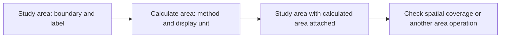
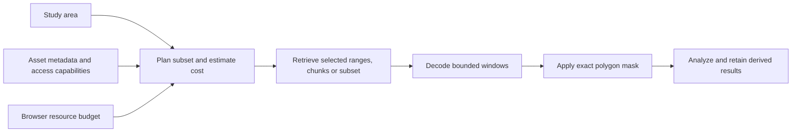

# Developmental evaluation: area computation and resource scope

_Created 2026-10-06 · Updated 2026-10-08_

Date: October 5, 2026. Continuation of the [study-area exercise](01-study-area.md). Evidence source: the user's design feedback during prototype development. These notes record requirements and architectural interpretations, not observed practitioner performance or a completed usability study.

## Feedback sequence and interpretation

| User feedback, in sequence | Interpretation and response | Evidence status |
| --- | --- | --- |
| Calculate the area bounded by the polygon; select metric or imperial units. | Provide polygon area and a persisted display-unit choice. Retain one canonical measurement in square metres. | Requested capability; local implementation and checks described below. |
| “Or should that be a computation?” | Make **Calculate area** a separate spatial-operation node consuming a Study area. | Accepted design direction, implemented locally. |
| “It would be like a recursive node? Applies to itself?” | Distinguish computing a property of the same geographic entity from a recursive workflow. A one-way connection consumes geometry and produces a measurement; it does not feed a result into itself. | Conceptual clarification. No observation that the visual representation is understood. |
| Study area as a “cookie cutter” for raster zonal statistics, remote-sensing/NetCDF clipping, feature extraction, and aggregation; represent these uses in the ontology. | Treat the area as reusable spatial scope with fan-out to independent operations. Describe operations and input/output provenance using established vocabulary. | Ontology declarations and design documentation; these additional operations are not executable yet. |
| More importantly, bounding boxes and polygons reduce asset sizes to fit browser resource constraints. | Put spatial scope into acquisition and decoding plans before expensive data loading. Distinguish transfer, decoded memory, computation and persistent-storage costs. | Architectural priority. No raster loader, subset planner or general browser-budget enforcement is implemented. |
| Record the discussion as developmental evaluation notes. | Preserve feedback, decisions, implementation evidence, unknowns and next evaluation questions in this record. | This document. |
| Clip a whole-file download while in flight, before registering it as a Fieldwork data source. | Add streaming ingestion as a candidate strategy. Register the validated derivative as the usable data source while preserving upstream asset metadata. Separate smaller retained output from reduced network transfer. | User-proposed hypothesis, refined below; no streaming clipping implementation or measured savings yet. |

## Decision A12: area is an explicit computation

The current workflow is:

The study area is the input, the calculation is an activity, and the workflow output is the same study area enriched with a measurement. The result references the same geographic entity and geometry; adding a computed property is not recursion. Graph cycles remain unsupported. EYE's study-area readiness inference and the JavaScript area calculation are separately identified in the evidence view.

**Calculation:** locally bundled `@turf/area` 7.3.5 computes approximate spherical polygon area using a mean Earth radius of 6,371,008.8 metres. It uses the polygon itself, subtracts holes and sums MultiPolygon components. The drawing widget still permits only a single exterior ring; the bundled Old Naledi boundary can be a MultiPolygon. The result is neither terrain surface area nor an ellipsoidal/survey measurement. Input precision and boundary choice affect its accuracy. [Turf area API](https://turfjs.org/docs/api/area), [algorithm source](https://github.com/Turfjs/turf/blob/v7.3.5/packages/turf-area/index.ts).

**Units:** m², km² and hectares appear under Metric; ft², acres and mi² under Imperial. Imperial conversion uses international feet and miles, not historical US survey feet. Unit changes do not alter geometry or canonical square metres. Display uses six significant digits; the receipt retains the unrounded numerical value. Any change marks prior results stale until rerun.

**Semantic representation:** `geo:hasMetricArea` attaches the square-metre value, typed `xsd:double`, to the geometry. A separate result entity carries `qudt:numericValue` with `qudt:unit` equal to `unit:M2`. PROV-O relates an operation execution to the study area and geometry it used and the measurement it generated. Activity and measurement IRIs include a run UUID; workflow feature/geometry IDs remain stable. Run receipts preserve the geometry snapshot. Do not union historical receipts into a single undifferentiated graph: stable geometry IDs may carry different coordinates across runs. [GeoSPARQL 1.1](https://docs.ogc.org/is/22-047r1/22-047r1.html), [PROV-O](https://www.w3.org/TR/prov-o/).

**Current UI:** add Calculate area from the library, select its Boundary input or connect a study-area output port, select Area unit, then Run. Its output port has type `area`, so it can connect to Check spatial coverage or other operations accepting a study area. The built-in map/measurement result tab remains a preview of that enriched area. General visualization nodes remain separate in the existing examples.

### Decision A19: pass the enriched study area downstream

In the hands-on exercise, the user noticed that Calculate area's output port had no compatible destination. The user clarified: “If calculate area is an operation on study area, it should output the study area with the calculation in it.” This supersedes the initial isolated `area-measurement` port design. A separate Display value node is not needed to make this operation composable.

The execution produces a copy of the input study area with a `measurement` containing canonical square metres, the chosen display value/unit, and the calculation method. Feature identity, geometry identity, boundary, label, readiness and existing metadata are preserved. The input snapshot is not mutated, so other branches directly connected to the original study area do not acquire the measurement implicitly. Another Calculate area may receive the enriched area; its selected display measurement replaces the previous display measurement while prior computation evidence remains available. Self-loops and graph cycles remain invalid.

Computed area RDF travels with the area as `areaFacts`. Check spatial coverage includes those facts in its N3 input and retains the measurement in its result. GeoSPARQL's `geo:hasMetricArea` still describes the geometry; the separate QUDT/PROV measurement entity records the computation's provenance. Enriching the workflow value does not create a new geographic feature. A boundary edit invalidates results; rerunning recalculates both area and spatial classifications. Coverage review still edits the original study-area source through its stable identity.

The next observation is whether users can distinguish an original study-area branch from an enriched branch and predict which attributes arrive downstream. This feedback establishes a design requirement, not practitioner-effectiveness evidence.

Validation for A19 on October 5, 2026: the build, all 18 unit tests and all five Chromium browser suites passed. The new checks verify unchanged input snapshots, preserved metadata and identities, typed downstream connections, cycle rejection, measurement facts in the coverage rule input, unchanged point classifications for unchanged geometry, recalculation after boundary expansion, and saved/imported connectors. The browser run uses actual EYE inference; `test-results/area-enriched-coverage.png` is a regenerable local screenshot. Firefox/WebKit were not tested.

## Decision A13: reuse the study area as spatial scope

The [experimental ontology](../../ontology/fieldwork.ttl) declares `fw:StudyArea` as a subclass of `geo:Feature`. `fw:SpatialOperation` is an execution class aligned with `prov:Activity`. `fw:studyArea`, `fw:inputGeometry`, and `fw:inputDataset` specialize `prov:used`. Outputs use `prov:generated` / `prov:wasGeneratedBy`; datasets can use DCAT. A workflow node describes configuration; an operation execution records what actually ran. The same area can feed many executions.

| Operation | Meaning of the study area | Contract still needed |
| --- | --- | --- |
| Area computation — implemented | The polygon whose area is measured | Current method and unit contract described above. |
| Raster zonal statistics — proposed | A zone over which raster values are summarized | Statistic, units, nodata, partial coverage, pixel inclusion and area weighting. |
| Raster clipping — proposed | A precise mask for the derived raster | Grid alignment, CRS, resolution, resampling, nodata and edge-pixel policy. |
| Multidimensional coverage subsetting — proposed | Spatial scope plus explicit variable, time, depth or other dimension selections | Coordinate interpretation, dimensional slicing, output resolution and whether polygon masking is also required. NetCDF is a data format, not the spatial operation itself. |
| Feature extraction — proposed | A spatial predicate selecting source features, or a boundary for clipping their geometry | Within versus intersects, treatment of boundaries, and selection versus actual geometric clipping. |
| Spatial aggregation — proposed | Reporting geography for grouped measurements | Measure, denominator, overlap/double-counting, missing-data policy and spatial relation. |

A bounding-box subset is not a polygon mask. Selection does not necessarily alter the selected features' geometry. Geometry compatibility, scientific assumptions and source metadata must be checked separately for each operation. Class declarations do not implement these operations or validate their inputs. No general OWL/GeoSPARQL entailment or SHACL engine has been added.

## Decision A14: reduce assets before expensive browser work

The user's priority is resource feasibility, in addition to geographic meaning. This is a proposed architecture for the next data-loading slice:

1. Inspect metadata before bulk loading: extent, CRS, resolution, dimensions, data type, nodata, chunk layout, compression, indexing and server access capabilities. A small polygon alone does not establish a small workload.
2. Keep the **requested study area**, **retrieval geometry**, and **precise mask geometry** distinct. A retrieval box or intersecting tiles may include data outside the polygon. Reprojection may require densifying transformed bounds; neighborhood operations may require a declared buffer/halo. Preserve those choices in the plan.
3. Estimate transfer bytes, decoded bytes, cell/feature counts, temporary buffers, concurrent work and storage. For a simple raster, `rows × columns × bands × selected times × selected depths × bytes per value` is a starting estimate, not peak memory. Masks, output arrays, decoder buffers and copies add costs. Compressed download size is not decoded size. Unknown cost must remain unknown.
4. Compare estimates with explicit budgets before downloading or allocating. If a plan exceeds them, expose the limiting dimension and alternatives: smaller scope, fewer variables/times, lower resolution or chunked processing. Do not silently change analytical resolution or silently fall back to an unbounded whole-file download. User-selected compromises must be recorded.
5. Retrieve the subset when the source permits it. COG tiles/overviews with HTTP range access, Zarr chunks, and supported remote NetCDF subsetting services are candidate access strategies. Verify browser CORS and actual partial-transfer behavior; format names alone do not guarantee compatible access. [OGC COG](https://www.ogc.org/standards/ogc-cloud-optimized-geotiff/), [Zarr core](https://zarr-specs.readthedocs.io/en/latest/v3/core/index.html), [Unidata subset services](https://docs.unidata.ucar.edu/tds/4.6/adminguide/tutorial/Subset.html).
6. Decode incrementally with bounded concurrency and release intermediate buffers. For an already local file, windowed reading can reduce decoded memory without changing the size of that file. Record estimated versus observed costs separately; do not claim measured peak memory where the browser cannot expose it reliably.
7. Retain only the intended results and deliberately selected offline assets within a storage budget. Shrinking output files after loading the complete source does not prove that transfer or peak-memory constraints were met.

`fw:AssetSubsetPlan`, `fw:ResourceBudget`, `fw:ResourceEstimate`, `fw:requestedArea`, `fw:retrievalGeometry`, `fw:maskGeometry`, and bounded cost properties are candidate ontology terms. They have **no enforcement behavior**. Existing drawing/import/sample-count limits are bounded prototype checks, not a general resource planner. No example byte budget is being presented as safe for every browser or device.

## Decision A15: stream, reduce, then register the derived source

The proposed ingestion sequence is `provider asset → streamed decode/filter/clip → validated reduced asset → registered Fieldwork data source`. A stream-capable format and decoder may let us process bounded records or windows, discard unwanted content, and write retained content incrementally without first storing the complete provider file. This can reduce persistent storage and some working-memory costs even when the provider exposes only a full-file endpoint. The browser can consume a Fetch response body as a stream. [Streams API](https://developer.mozilla.org/en-US/docs/Web/API/ReadableStream).

The feedback uses “download size” in a way that needs operational definition:

| Quantity | Whole-file-only endpoint with client-side streaming clipping |
| --- | --- |
| Bytes transferred over the network | Usually the complete response still has to arrive. Client filtering cannot remove bytes already received. A smaller retained file does not establish bandwidth savings. |
| Received response-body bytes | Can be counted while streaming, but may differ from on-wire bytes due to HTTP compression, framing and caching. Name the measurement precisely. |
| Peak working memory | Can be smaller with incremental parsing, bounded decoding and backpressure. Compression, indexing and random-access dependencies may still require larger buffers or temporary storage. Streaming transport alone does not guarantee bounded decoding. |
| Retained dataset bytes | Can be smaller because only the selected content is written and registered. Output size also depends on encoding, metadata overhead and recompression. |

Reduced network transfer requires an additional condition: supported partial/range access, upstream subsetting or clipping, a proxy returning a reduced response, or a provably safe early stop. A provider's download button may expose a full file while the same endpoint still supports byte ranges; verify actual responses rather than inferring support from the UI. Servers may ignore Range requests. A proxy moves the clipping workload outside the browser and may still receive the complete upstream file. [HTTP range semantics](https://www.rfc-editor.org/rfc/rfc9110.html#name-range-requests).

Cancellation is safe only when indexing or format/ordering guarantees establish that all required content has been read. It is not sufficient that several desired features have already appeared. Do not mark a truncated or failed ingest as a complete source.

**Registration and provenance:** register the validated derivative as the usable data-source node after successful completion. Keep the original asset's metadata as a provenance entity even if its full bytes are never retained locally. Use `prov:wasDerivedFrom` between derivative and source asset, and record the clipping activity, study area, geometry snapshot, method, source version/identifier, requested and actual coverage, completion state and available byte counts. Distinguish staging artifacts from completed registered sources. This avoids losing lineage while keeping the working dataset small.

The ontology declares proposed `fw:StreamingSpatialSubset`, `fw:DerivedSpatialDataset`, and resource-observation terms. They describe a candidate ingest contract, not an implemented loader. The next experiment should compare full retained download against streamed clipping using the same known dataset and polygon, with separate transfer/body/storage counters and an output-completeness check.

## Next developmental evaluation

The [geoprocessing memory lifecycle follow-up](06-geoprocessing-memory-lifecycle.md) extends A14/A15 with proposed worker lifetimes, output ownership, cancellation and memory observations. Subsetting reduces work; disposing a job runtime addresses the lifetime of its remaining allocations. Both need independent validation.

Observe whether a practitioner can distinguish the saved boundary, the calculation node and its result; explain why unit changes leave the geometry unchanged; and reuse one area as two operation inputs. Then test a real asset-loading slice on a constrained device: compare whole-asset metadata with the proposed subset, inspect estimated costs, exercise an over-budget plan, and verify actual partial retrieval and offline replay.

Capture the source asset/version, boundary snapshot, grid/dimension choices, method, budget, estimated and observed costs, errors, user interventions, and result provenance. Distinguish direct observations, practitioner explanations, evaluator interpretations, and software checks. There are no participant-performance findings or measured resource savings from this discussion.

## Implementation evidence

The subsequent point-input, spatial-exception, and pushpin-form exercise is recorded in [developmental evaluation notes 03](03-input-data-and-spatial-review.md).

`area-computation.js` supplies the numerical operation and conversions; `area-measurement.js` creates the computation receipt and RDF; `core.js` executes the dependency graph. The local bundle supports offline computation. Numerical tests compare an analytic spherical rectangle, ring reversal, triangle versus bounding box, holes and MultiPolygon sums. Workflow tests check input requirements, stable geometry identity, unit invariance and recalculation after editing. Browser checks exercise all six units, the visible connector, receipts, export/import and offline reopening. These checks do not validate the proposed raster/NetCDF/resource-planning capabilities.
