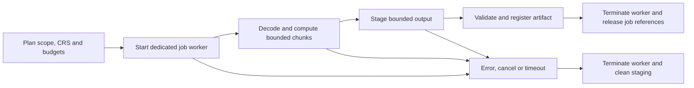

# Developmental evaluation: geoprocessing memory lifecycle

_Created 2026-10-06 · Updated 2026-10-08_

Date: October 5, 2026. The user supplied an AI overview proposing disposable workers, arena allocation and Wasm multi-memory for releasing heavy geoprocessing memory. This record assesses those suggestions and extends the [asset resource plan](02-area-computation-and-resource-scope.md). These are architectural proposals, not an implemented executor or measured memory savings.

## A25: give heavy jobs a disposable execution lifetime

Use a dedicated, short-lived worker as the candidate default for each heavy geoprocessing job. Instantiate the decoder/geoprocessing Wasm runtime inside it. Keep workflow configuration, source references and completed results outside that worker. This provides an explicit cancellation boundary and prevents an intentionally reused engine from retaining its largest heap indefinitely. Benchmark initialization costs before choosing a reusable worker pool.

The supplied overview needs several qualifications:

| Mechanism | What it provides | What it does not establish |
| --- | --- | --- |
| Free allocations or reset an arena | Space can be reused inside a live heap. | A smaller linear memory, immediate OS memory release or erased data. |
| Terminate a dedicated worker | Stops execution; isolated state can become unreachable and eligible for reclamation. | A guarantee of immediate garbage collection, lower process memory or secure erasure. References and shared resources outside the worker still matter. |
| Drop an instance reference | Can permit reclamation when the instance and its resources are no longer reachable. | Disposal while exported functions, memory, views or other references keep resources alive. |
| Multiple Wasm memories | A module can address separate linear memories. | Hot-swapping a live instance's memory slot or freeing it merely by dropping a JavaScript reference. |

Worker termination discards tasks and aborts execution; the specification does not promise a particular garbage-collection or OS reclamation schedule. Do not describe it in the UI or evidence as “memory wiped.” [HTML worker termination](https://html.spec.whatwg.org/multipage/workers.html#terminate-a-worker).

Wasm memory imports are resolved when an instance is created. Multi-memory adds indexed memories and instructions, not a JavaScript operation for rebinding an existing instance's memory. Creating a new instance with a new imported memory is a different lifecycle; the old memory must still become unreachable. Multi-memory is not selected as our reclamation mechanism, and engine/toolchain support must be tested before depending on it. [WebAssembly JavaScript API](https://www.w3.org/TR/wasm-js-api-2/), [multi-memory design](https://github.com/WebAssembly/multi-memory/blob/main/proposals/multi-memory/Overview.md).

For the baseline runtime contract, do not assume a portable linear-memory shrink operation. Memory-control proposals are not a capability of every chosen browser/library build. An arena is a possible later optimization for repeated bounded work, but the pasted Rust sketch omits bounds, overflow, alignment, lifetimes and destruction requirements. Resetting its offset alone neither zeroes bytes nor safely manages arbitrary values. Do not copy that sketch into an engine. [Memory-control proposal](https://github.com/WebAssembly/memory-control/blob/main/proposals/memory-control/Overview.md).

## A26: make ownership and completion part of the job contract

Proposed lifecycle:

The supervisor should enforce these proposed rules:

1. Identify the run, node and job separately. Supply source identity/version, study-area snapshot, source/target CRS, method/version and explicit resource limits. Reject unsupported operations before loading large inputs.
2. Start with one heavy geoprocessing job at a time. Account separately for any concurrent reasoning worker, rendered maps and retained results. A worker is not a process-wide memory quota.
3. Subset before decoding wherever possible. Bound chunk size, outstanding requests and output queues; require backpressure. Streaming transport alone does not bound a decoder's allocations.
4. Define ownership at each boundary. Transferring an ordinary `ArrayBuffer` detaches the sender's buffer; other workflow branches and retries need a retained source handle or an explicitly budgeted copy. Prepare an independently owned output buffer instead of attempting to transfer the Wasm heap. Encoding or copying from that heap adds a temporary peak even when the subsequent message uses transfer. Transfer semantics do not prove zero-copy behavior throughout the pipeline. [HTML transfer and structured serialization](https://html.spec.whatwg.org/multipage/structured-data.html#transferable-objects).
5. Validate the output's size, completeness, schema, CRS and expected coverage before registering it as a usable data source. Publish a completed artifact and receipt together. Failed or cancelled staging is not a completed dataset; keep earlier completed results identifiable as belonging to their previous run.
6. Handle success, failure, cancellation, timeout and superseded runs explicitly. Ignore stale messages using job/run identifiers. Include initialization in the timeout. Cooperative cancellation works only when the engine yields; the main thread must be able to terminate a stuck worker.
7. Release supervisor references and close job-owned handles on every terminal path. Do not depend on worker `finally` blocks after forced termination. Worker termination does not delete persistent files: use a staging manifest and recovery cleanup for abandoned OPFS artifacts, if OPFS is adopted.

Cache engine code and approved offline resources separately from live instances. A fresh worker need not imply a fresh network download. Shared memory would require a different ownership/lifetime contract; it is outside this first job design.

## A27: distinguish resource budgets from resource observations

The planner should account for input chunks, decoded arrays, the Wasm heap, masks, intermediate arrays, output encoding/copies, message queues and retained UI results. Download size and Wasm heap size are each insufficient estimates of total working memory.

| Proposed budget or observation | Meaning |
| --- | --- |
| Transfer/body bytes and retained bytes | Keep the distinctions already recorded in A15; storage reduction is not necessarily bandwidth reduction. |
| Maximum Wasm linear-memory bytes | A supported engine/build limit, not a cap on all JavaScript, graphics or browser memory. Verify the selected binary's configuration. |
| Decoded bytes, cells/features, chunk size | Preflight estimates plus adapter checks before allocations and during processing. Unknown costs remain unknown. |
| Maximum output bytes and concurrent jobs | Limits on retained artifacts and simultaneous work, including temporary output copies. |
| Job deadline | A supervisor cancellation policy, not evidence of bounded memory. |
| Observed memory | Name the measurement and its scope: logical Wasm capacity, tracked buffer sizes, or browser-specific profiling. Mark unavailable measurements explicitly. |

Toolchain settings such as Emscripten's memory limits must be checked for the actual build; wrapping a supplied binary does not automatically change them. [Emscripten memory settings](https://emscripten.org/docs/tools_reference/settings_reference.html#maximum-memory).

In the semantic model, use the existing candidate `fw:ResourceBudget`, `fw:ResourceEstimate` and `fw:ResourceObservation` entities alongside the `fw:SpatialOperation` / `prov:Activity` execution. Link source and output entities through PROV. Keep large arrays in artifacts, with identifiers and measured metadata in the graph. Job lifecycle fields and additional budget predicates remain a contract to define in the implementation slice; this note adds no executable ontology enforcement. “Termination requested” is an observation about an action, not proof that RAM was returned to the OS.

The Inspector should eventually expose scope, estimated costs, limits and cancellation status in practitioner language. An over-budget plan should offer smaller extent, fewer variables/times, or an explicitly selected resolution change. Do not silently lower analytical resolution. Outputs retained for maps, undo, exports or subsequent nodes continue to consume resources after the job worker ends.

## Current implementation and next experiment

Source inspection on this date establishes:

- `app.js` reuses the EYE reasoning worker after successful requests. Its 45-second timeout and worker error handler terminate it. This is not yet the proposed per-job geoprocessing lifecycle.
- `input-data.js` retains the initialized sql.js module in a cached promise. `input-data-ui.js` reads the bounded GeoPackage into memory and closes databases when replaced or the dialog closes. Closing a database does not dispose that cached Wasm runtime.
- Existing point/file limits are prototype checks. Generic geoprocessing memory budgeting, cancellation and disposable workers have not been added by this decision.

The next bounded spike can pair this contract with the proposed [Reproject node](05-coordinate-reference-systems.md): use synthetic geometries and known reference transformations first, then a separately bounded raster operation when an adapter is selected. Compare disposable execution with reuse using the same inputs, output accuracy checks, repeated runs and cold/warm startup timings. Test cancellation, timeout, allocation failure, oversized/malformed output, superseded messages and interrupted staging. Confirm UI responsiveness and offline execution with required resources cached.

Record engine/library versions, device/browser, job counts, logical heap capacity, tracked bytes and any available process measurements separately. Observe behavior after repeated completion/cancellation; do not infer reclamation solely from a disappearing worker or a passing output test. Chromium observations do not establish Firefox/WebKit behavior.

Developmental evaluation should ask whether practitioners can predict what cancellation discards, identify which completed data remains available, and choose a defensible response to an over-budget plan. Software correctness, resource profiling and practitioner understanding require separate evidence. This record supplies a design and source assessment only; no memory-reclamation benchmark or participant evaluation has been conducted.
