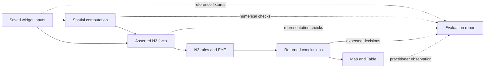

# Design experiment for evaluating N3 workflow outputs

_Created 2026-10-06 · Updated 2026-10-06_

Date: October 5, 2026. Status: proposed evaluation protocol, grounded in the current prototype and regression tests. Audience: Fieldwork developers, public health practitioners and domain reviewers.

This experiment asks whether a visual GIS workflow produces the intended semantic representation and conclusions, and whether a practitioner can inspect, explain and challenge them. It begins with Study area, Calculate area, Input data and Check spatial coverage, followed by Map and Table outputs. Old Naledi provides geographic context for a later transfer exercise. Disease transmission, agent behavior and intervention effectiveness are outside this first experiment.

The central design decision is to evaluate the chain from a saved widget value to an observed result. A successful reasoner run is one checkpoint. It does not establish that coordinates are correct, a spatial approximation is suitable, or a public health assumption is justified.

## Current capability and proposed additions

| Available now | Proposed in this document |
| --- | --- |
| Generated facts and rules, actual EYE execution, returned conclusions | A reusable evaluation manifest with independently authored expectations |
| N3 & evidence view and downloadable run receipts containing the executed workflow | An Evaluation results tab with expected and actual values, status and supporting evidence |
| Runtime validation of workflow, geometry, attributes and coverage decisions | SHACL checks over selected RDF fact and conclusion graphs |
| Unit tests, Chromium integration tests and a frozen compatibility workflow | Systematic graph comparison, controlled fault injection and participant sessions |
| Offline execution after assets have been cached | A packaged, versioned evaluation report that can be replayed offline |

The current worker returns assertions and literal metadata; it does not export a derivation proof. Existing explanations assemble inputs, rules and conclusions. An evidence link must therefore be described as supporting evidence, without claiming a formally checked EYE proof certificate. See [reasoning-worker.ts](../../src/reasoning-worker.ts) and [the application evidence renderer](../../src/app.ts).

## Questions and hypotheses

| Question | Hypothesis to investigate | Evidence that would challenge it |
| --- | --- | --- |
| Do widgets preserve the meaning of entered data? | Labels, identities, coordinates, units and types survive translation and reload. | Changed axis order, text becoming a number, lost attributes or records merged across sources. |
| Do spatial calculations supply correct facts? | Bounded examples agree with an independent reference under the stated numerical model. | A point in the bounding box but outside the polygon is classified inside; area changes when only its display unit changes. |
| Do rules implement the declared policy? | Each checked record receives the expected decision and no conflicting decision. | A missing-location record is accepted, or a record receives both Accept and Review. |
| Can a practitioner challenge the outcome? | The participant can identify a rule, distinguish missing data from an error and make an appropriate correction. | An outside point is deleted merely because it is outside, or a green test result is interpreted as scientific endorsement. |
| Can an evaluation be reproduced? | Saved inputs and rule versions reproduce the same domain conclusions offline. | Results depend on stale state, live tiles or the order of independent layers. |

These are hypotheses, not findings. The latest recorded software gate passed 33 unit tests and 21 Chromium scenarios; that evidence covers named assertions rather than every hypothesis here. No participant sessions are reported in this document. The [functional baseline](07-functional-regression.md) and [latest validation record](10-canvas-colors.md) describe the existing evidence.

## A40 Evaluate each stage independently



| Layer | Check | Reference or comparison | Limit of a pass |
| --- | --- | --- | --- |
| Input and persistence | Draft versus saved state, stable IDs, source separation, typed values and allowed sets | Authored input fixture and export/reload comparison | Does not establish the truth of an observation. |
| Semantic representation | Feature/geometry link, WKT, explicit CRS, literal datatype, label, missing-value representation | Field-level assertions and proposed RDF shapes | Valid structure can still contain incorrect coordinates. |
| Spatial computation | Inside, boundary and outside relations; area and conversion | Analytic shapes and a separately reviewed reference method | Agreement under a spherical model does not establish survey accuracy. |
| Rule behavior | Required conclusions, prohibited conflicts and decision coverage | Expected decisions written before executing EYE | Correct implementation does not justify the policy. |
| Evidence and presentation | Run, node, source and record links; Map/Table agreement; stale-result labeling | Executed receipt, outputs and interaction tests | A readable explanation is not a proof certificate. |
| Practitioner and domain interpretation | Prediction, explanation, correction and recognition of limitations | Observations, participant reasoning and domain review | A small formative trial cannot establish broad effectiveness. |

Use the [GeoSPARQL 1.1 specification](https://docs.ogc.org/is/22-047r1/22-047r1.html) to review the vocabulary and geometry representation. In particular, WKT axis order follows the identified CRS. Fieldwork uses explicit CRS84 longitude/latitude order; relabeling it as EPSG:4326 is not a reprojection. Check both the metadata and coordinates. Vocabulary use alone is insufficient evidence of complete GeoSPARQL conformance.

EYE parsing checks the application's supported N3 input, while rule expectations check behavior. Record the engine version and supported constructs; do not assume that passing these examples establishes full language conformance. The [Notation3 Community Group specification](https://w3c-cg.github.io/N3/spec/) supplies the language reference, with its Community Group publication status distinguished from a W3C Recommendation.

## The first controlled coverage experiment

Use a synthetic rectangle near Old Naledi with west/east longitudes 25.89 and 25.91 and south/north latitudes -24.70 and -24.68. This is an illustrative test boundary, not the actual Old Naledi polygon. Enter exact coordinates through a fixture or coordinate fields so mouse placement does not become the reference answer.

Prepare a source called `observations` with the following cases. Keep the expected answers separate from the workflow inputs. For the exclusion case, use a separate copy of the outside record or a subsequent run, and supply a reason.

| Case | Coordinates in longitude/latitude order | Expected spatial fact | Expected decision | Decisions that must be absent |
| --- | --- | --- | --- | --- |
| Inside | 25.90, -24.69 | Inside | Accept | Review, Excluded |
| Edge | 25.91, -24.69 | Boundary | Accept | Review, Excluded |
| Vertex | 25.91, -24.68 | Boundary | Accept | Review, Excluded |
| Outside | 25.92, -24.69 | Outside | Review | Accept, Excluded |
| Missing location | No coordinates | MissingLocation | Review | Accept, Excluded |
| Explicitly excluded outside record | 25.92, -24.69 | Outside | Excluded | Accept, Review |

The relevant existing rule is:

```n3
@prefix fw: <urn:fieldwork:>.

{ ?record fw:excluded false;
          fw:spatialRelation fw:Outside. }
=> { ?record fw:coverageDecision fw:Review. }.
```

The point relation is computed before this rule runs. The rule expresses the review policy. Validate those two steps separately. An outside record requires investigation; it does not establish a data-quality defect. An excluded record remains in the source and evidence, while the retained downstream dataset omits it. These are current contracts in [spatial-coverage.ts](../../src/spatial-coverage.ts).

Repeat with a triangle formed by the rectangle's southwest, southeast and northwest vertices. The point 25.907, -24.683 lies within its bounding box but outside that triangle. Expect Review. This detects accidental substitution of the bounding box for the actual polygon.

For numerical area, use the analytic latitude/longitude rectangle reference already exercised in [area tests](../../tests/area-measurement.test.mjs):

```text
A = R² × |longitude_east - longitude_west| × |sin(latitude_north) - sin(latitude_south)|
R = 6,371,008.8 metres; all angles are in radians.
```

This independently expresses the expected result under the same spherical assumption. The existing unit comparison uses a tolerance of `max(1, abs(expected)) × 1e-10` square metres. Record that as a computational comparison tolerance, not real-world positional accuracy. For a future ellipsoidal or projected reference, document the method difference and agree an appropriate tolerance before accepting results. Another library using the same underlying algorithm offers limited independence.

## A41 Preserve expectations independently of results

Author and review expected outcomes before executing the implementation. Freeze the input fixture, expectation version, rationale and reviewer. Never copy the current output into the expected output simply to make a failure disappear. An intentional policy change gets a new expectation version and an explanation; the older compatibility case remains available.

A proposed manifest could contain:

```json
{
  "schema": "fieldwork/evaluation/1",
  "caseId": "coverage-outside-01",
  "workflowFixture": "coverage-evaluation-v1.json",
  "expectationVersion": "1",
  "checks": [{
    "nodeId": "coverage",
    "sourceNodeId": "observations",
    "recordId": "outside",
    "predicate": "urn:fieldwork:coverageDecision",
    "requiredObjects": ["urn:fieldwork:Review"],
    "forbiddenObjects": ["urn:fieldwork:Accept", "urn:fieldwork:Excluded"]
  }]
}
```

This schema and the named fixture are illustrative and are not implemented files. A reusable manifest would also record the expected input identity, rule identity, reference method, numerical tolerance where applicable, and assertion rationale.

Compare RDF terms and graph structure rather than raw N3 text. Prefix aliases, triple ordering and generated blank-node labels can differ without changing the represented facts. Preserve datatype and language information; text `"5"` and integer `5` must not be silently conflated. Use explicit numerical comparisons for measurements. Compare stable domain identities separately from run IDs and timestamps, while retaining the original metadata in the report.

The first comparison adapter should support the flat fact and conclusion graphs currently exported. General quoted N3 formulas, graph contexts and proof structures need their own representation contract. A graph-isomorphism or canonicalization library has not been selected in this experiment.

## A42 Scope evaluation to a run and node

Use `(run ID, node ID, source node ID, record ID)` to identify a decision under evaluation. Different coverage nodes can intentionally apply different boundaries to the same record. Combining their receipts into one unqualified graph could make legitimate differences appear contradictory. Evaluate each node's conclusion set in its own run context.

Check every expected record, and reject unexpected decision-bearing records within that node's declared input scope. Require exactly one distinct supported coverage decision per record. Unrelated provenance triples are not extra coverage decisions. The current coverage executor checks consistency for each input record; exhaustive graph comparison and injected unexpected subjects are proposed additions.

Absence from a completed, scoped result can fail a required-output assertion. It must not become a new N3 fact asserting that the real-world proposition is false. Missing input, incomplete execution and a valid negative finding have different meanings.

For a future shape-validation layer, use [SHACL](https://www.w3.org/TR/shacl/) for RDF graph constraints such as required properties, cardinality, permitted decision values and datatypes. Validate asserted data before inference and the selected conclusion graph after inference. Shapes should allow a known missing-location record to lack geometry. A shape requiring all observations to have coordinates would contradict the current MissingLocation contract. SHACL does not by itself validate the N3 rule program, prove polygon topology or establish scientific validity. No SHACL engine or shapes are installed by this document.

## Deliberate changes and faults

| Change to the controlled case | Required observation | Evaluation purpose |
| --- | --- | --- |
| Rename the study area | Label changes; geometry, record decisions and canonical area remain equal. | Separate identity and presentation from computation. |
| Switch square metres to square kilometres or acres | Display conversion changes; canonical square metres and coverage decisions remain equal. | Verify unit semantics. |
| Expand the east edge to 25.93 with no active exclusion | The former outside point becomes inside and receives Accept after rerun. | Verify recomputation and sensitivity to boundary changes. |
| Keep an explicit exclusion while expanding the boundary | The exclusion persists for the unchanged source-record snapshot until restored explicitly. | Separate human review decisions from spatial changes. |
| Edit an excluded record's attributes or coordinates | The old exclusion no longer matches its snapshot; the new record state is evaluated again. | Verify review applicability. |
| Reorder independent layers; reuse a record ID in two sources | Decisions remain attached to the correct source/record pair. | Detect identity collisions and order dependence. |
| Reverse a valid polygon ring | Area and point decisions remain equivalent. | Test a geometry-preserving transformation. |
| Reload offline after caching | Equivalent domain results; new run metadata may differ. | Verify reproducibility. |
| Change an input after a completed run | Previous results and evaluation become visibly stale until rerun. | Prevent conclusions being attributed to unexecuted edits. |
| Supply an invalid typed value or unsupported CRS | Input is rejected with an actionable error; the saved workflow survives. | Verify failure recovery. |
| Remove a decision rule or inject a conflicting conclusion in a test harness | Required/forbidden assertions detect the deliberate defect. | Check that the evaluation itself can fail. |

Fault injection belongs in isolated tests or a clearly marked test copy, not a practitioner's saved workflow. A test that remains green after its target defect is introduced has not demonstrated useful detection. Most transformation cases build on existing tests; a systematic mutation harness remains proposed.

Near-edge cases require additional care. The current implementation includes boundary points and has no uncertainty buffer. An exactly constructed edge point is suitable for testing that policy. It does not settle how GPS uncertainty should be handled. Record positional uncertainty as a domain issue for a later experiment instead of introducing an undocumented tolerance.

## Practitioner session protocol

Start with one facilitated pilot, then a proposed formative round of four to six practitioners with varied GIS and semantic-language experience. Record relevant experience and assistance rather than treating the small sample as representative. Use synthetic records; the experiment needs no patient data. A suggested session lasts 35–45 minutes, with timing revised after the pilot.

1. **Predict.** Present the rectangle and five unexcluded cases. Ask for expected outcomes and reasoning before showing the application's decisions. Record uncertainty and any disagreement with the boundary-inclusion policy.
2. **Build and run.** Start with an empty canvas. Add the area, area calculation, input, coverage, Map and Table nodes. Record discoverability, connector errors and assistance separately from inference failures. Use exact fixture coordinates for correctness checks.
3. **Inspect.** Open N3 & evidence, identify one input fact and its relevant rule, then locate the returned conclusion and export a receipt. Ask whether the area measurement was computed or inferred and what a readiness assertion establishes.
4. **Challenge.** Give the outside point a scenario explanation. Ask whether to correct coordinates, exclude with a reason, retain for review or revise the boundary. Judge the justification against the supplied scenario, not a universal preference for one action.
5. **Change and recover.** Expand the boundary, change an area unit, encounter an invalid attribute and correct it. Ask the participant to predict each change and notice stale results before rerunning. Reopen saved work offline.
6. **Transfer.** Repeat a smaller task using the actual bundled Old Naledi boundary and fresh synthetic points. Ask which assumptions remain and what additional evidence would be needed before using results in a public health simulation.

Capture task completion, assistance count, time to locate evidence, prediction versus result, correction success and the participant's explanation. For each concept, use a simple provisional rubric: 0 = incorrect or unable to explain; 1 = correct with prompting; 2 = independently correct with a reason. Score concepts separately: axis order, computed versus inferred values, outside versus erroneous observations, missing data, explicit exclusion and stale results. Do not collapse these into a single validation score.

Ask confidence before and after inspecting evidence. Confidence rising despite an incorrect explanation is a finding to investigate. Record exact misunderstandings and interface conditions, including hidden errors or save confusion; those are distinct from defects in a rule.

After a candidate Evaluation tab exists, compare it with the current N3 & evidence view using equivalent cases and alternating presentation order. Record carryover and facilitation. A later Logical English comparison should hold data, policy and expected conclusions constant so language and presentation effects can be examined separately. Neither comparison is conducted by this document.

## A43 Design the Evaluation tab as a consumer of evidence

The proposed tab reads an immutable run receipt plus an expectation manifest. Expected answers never enter the facts supplied to EYE. The evaluator must not modify source records, rule inputs, review decisions or the workflow that produced the receipt.

Show the evaluated run and rule versions, counts of checked and unassessed cases, and a table with check, expected value, actual value, status and evidence link. A failed row should lead to the relevant node, record, fact or rule. Offer a practitioner explanation first with raw N3 available for inspection. Keep software-check status separate from domain-review status and participant observations.

Use explicit statuses:

- **Pass:** a completed check matches its declared expectation.
- **Fail:** a completed check contradicts its expectation.
- **Error:** parsing, execution or the evaluator failed.
- **Not assessed:** no applicable expectation or required reference is available.
- **Stale:** the displayed evaluation belongs to an earlier workflow state.

An empty check list, a timeout or an unsupported assertion type must never produce an overall pass. If execution fails, preserve its diagnostic and mark dependent checks Not assessed. Repeating the same run with the same manifest should reproduce domain check outcomes, with environment and timing differences recorded separately.

## A44 Retain an evaluation record and revise the design

Preserve the executed workflow and input snapshot, generated facts, exact rules, returned assertions, expectation manifest, per-check results, application revision, engine/spatial-library versions, browser version, online/offline state and timings. Keep the original receipt alongside the comparison result. Input/rule digests and a combined evaluation package are proposed additions; they are not fields guaranteed by the existing run-receipt format.

Use [PROV-O](https://www.w3.org/TR/prov-o/) to represent an evaluation activity that used a run receipt and an expectation set and generated a report. Provenance documents the lineage of a result; it does not certify its correctness. Participant observations should be linked as separate evaluation evidence with only the local identifiers needed for analysis.

For each discrepancy, record: case and run; expected and actual outcome; affected stage; evidence; participant interpretation if observed; suspected cause; design decision; implementation or documentation change; and the regression check or next session that will assess it. Keep observed facts distinct from the proposed explanation.

For this bounded software slice, require all declared critical assertions to pass, no conflicting decisions, no missing expected records, correct source identity and successful save/replay recovery. Report the number and scope of checks. A scientific reviewer must separately assess whether the chosen boundary, data quality, approximation and policy suit the intended public health question. No numerical usability success threshold is claimed yet: use the pilot to revise tasks and identify recurring misunderstandings before setting a justified target.

Pause expansion of the slice when a reproducible defect changes a decision or loses evidence. Preserve the failing case, fix it and rerun the relevant regression gate. For conceptual misunderstandings, revise the wording or interaction and repeat the task with a fresh case. This closes the developmental loop through observation, interpretation, design change and reassessment.

## Implementation sequence and evidence boundary

| Next step | Concrete deliverable | Completion evidence |
| --- | --- | --- |
| 1 | Reviewed synthetic cases and separate expectations based on the existing compatibility fixture | Expected values and rationales checked before execution |
| 2 | Scoped assertion comparator and deliberate failure cases | Correct cases pass and injected defects fail using real EYE execution |
| 3 | Proposed Evaluation tab and downloadable report | Expected/actual links, stale/error states, isolation and offline replay tested |
| 4 | Facilitated pilot and revised session script | Recorded observations and explicit design revisions |
| 5 | Small formative round and Old Naledi transfer exercise | Case-level findings with assistance and limitations reported |
| 6 | Candidate SHACL shapes and selected engine, if structural gaps justify them | Separate shape tests, including valid missing-location records |

Current anchors include [study-area representation tests](../../tests/study-area.test.mjs), [spatial and attribute unit tests](../../tests/input-coverage.test.mjs), [area computation tests](../../tests/area-measurement.test.mjs), [input and real-EYE browser tests](../../tests/input-coverage.browser.mjs), and the [frozen workflow replay](../../tests/workflow-compatibility.browser.mjs). Some unit tests use a stub reasoner to isolate workflow plumbing; only actual-engine browser checks are evidence of EYE execution. Existing string assertions inspect selected facts rather than proving graph-wide conformance.

This document adds a protocol and architectural decisions A40–A44. It does not implement the manifest, comparator, Evaluation tab, SHACL integration, proof verification or participant study. The documentation was reviewed against current source and test contracts and the linked primary specifications. Runtime tests need not be rerun for this documentation-only change.

The proposed [workflow learning and gamification experiment](27-workflow-learning-and-gamification.md) builds on this separation of computational correctness and practitioner understanding. It adds bounded learning milestones, independent transfer tasks and a comparison of explanatory feedback with and without points; scores are not scientific-validity judgments.
