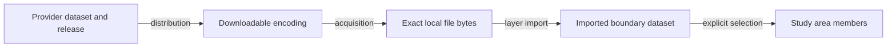

# GADM assets and jurisdiction study areas

_Created 2026-10-06 · Updated 2026-10-08_

Date: October 6, 2026. Status: ontology and executable N3 examples; polygon ingestion, jurisdiction selection widgets and GADM retrieval are not yet implemented in the application.

Fieldwork will let a practitioner acquire administrative boundaries, select named places and use those places as a study area. A study can span several countries and disconnected regions while retaining each member for comparison. GADM is the first provider profile; the underlying asset and jurisdiction model also applies to other boundary sources.

## Design feedback

The heat example exposed a modeling gap: neighborhood locations, cooling centers and heat alerts are all input data, with different structures and roles. Alert coverage may reference named jurisdictions. The study area is independently chosen and may include multiple jurisdictions, as in a comparison of coastal cities worldwide. A jurisdiction label alone is insufficient to identify a boundary or to establish that an alert applies to a point.

This experiment models the boundary-data portion first. It does not refactor the heat widgets or define alert timing and applicability rules. GADM files remain user-acquired assets; no provider geometries are included in the repository.

## A52 Separate dataset distribution and acquired bytes

Use a provider dataset with an explicit release and spatial scope, described with `dcat:Dataset` and `dcat:version`. A downloadable encoding is a `dcat:Distribution` with `dcat:downloadURL`, format and source terms. A locally acquired file is a distinct `fw:DownloadedAsset` with filename, byte count and SHA-256. An acquisition activity records when and how those bytes were obtained. These distinctions follow [DCAT 3](https://www.w3.org/TR/vocab-dcat-3/) and [PROV-O](https://www.w3.org/TR/prov-o/).

A GeoPackage may contain multiple layers. Import records the selected layer, source CRS and axis interpretation, then produces a local collection of boundary features. Compressed downloads also need extraction provenance: the downloaded archive and extracted member have different hashes and sizes. Dataset release, retrieval time and boundary validity are separate fields; one must not substitute for another.

The existing `fw:sha256` and `fw:byteSize` terms identify local bytes consistently with PDF references. They are not claimed to be provider-published checksums. A future general asset store must hold large geometry files outside workflow localStorage; the existing PDF storage implementation is not a polygon asset store.

## A53 Preserve jurisdiction identity and boundary versions

`fw:Jurisdiction` represents an administrative territory, not its governing organization. `fw:JurisdictionBoundary` is its representation in a particular source dataset version. The latter links to the former with `fw:representsJurisdiction`, to the dataset with `fw:boundaryDataset`, and to its geometry with `geo:hasGeometry`. Geometry uses GeoSPARQL WKT with explicit CRS84 longitude/latitude order after source interpretation. Polygon holes and multipart geometry must survive import. [GeoSPARQL 1.1](https://docs.ogc.org/is/22-047r1/22-047r1.html)

For a real import, mint a source-scoped jurisdiction IRI from the complete GID, and a separate boundary IRI from dataset identity/version, country, layer and complete GID. Escape components; do not concatenate unvalidated field strings. Never use a display name as the key. If files claiming the same dataset version contain conflicting feature content, retain the asset hashes and flag the conflict; do not overwrite the earlier boundary silently. Do not assert `owl:sameAs` across providers or boundary versions.

The GADM profile maps the documented fields below. Their availability must be checked in the actual layer; missing optional fields remain absent. The GID suffix is separate from the dataset release. Administrative levels have country-specific meanings. [GADM metadata](https://gadm.org/metadata.html)

| Source field | Representation or handling |
| --- | --- |
| `GID_i` | Complete `dcterms:identifier`, qualified by `gadm:GIDScheme`; retain the original value. |
| `NAME_i` | Boundary display label; qualify in the UI with country and ancestors. |
| `GID_0`, ancestor `GID_*` | Country context and parent lookup within the same release. Resolve explicit fields, not string truncation. |
| `TYPE_i`, `ENGTYPE_i` | Local and English administrative-type text. |
| `VARNAME_i`, `NL_NAME_i` | Preserve raw alternate and non-Latin names; future search aliases must retain their origin. |
| `HASC_i`, `CC_i`, numeric IDs | Preserve as source attributes; do not assume they equal another provider's identifiers. |
| `VALIDFR_i`, `VALIDTO_i` | Preserve partial dates and values such as Unknown/Present; do not invent precise dates. |
| Every original scalar field | Retain via `fw:attribute`, `fw:fieldKey` and `rdf:value`, alongside mapped terms. Distinguish missing fields from explicit nulls using the existing missing-value convention. |

Administrative parentage uses `fw:parentJurisdictionBoundary`; it does not establish a computed `geo:sfWithin` relation. A county's membership in a state and a coordinate's geometric containment require different evidence.

## A54 Select boundary members without forcing a union

`fw:hasStudyAreaMember` links a study area to the selected versioned features. Members can be jurisdictions or custom zones and can be geographically disconnected. Membership preserves per-place labels, geometry and provenance. A study area may have a separately computed aggregate geometry, but selection does not create one automatically.

Do not call every city footprint a jurisdiction: administrative boundaries, built-up areas and coastal buffers represent different analytical choices. Likewise, appending polygons into a MultiPolygon is not always a valid union when members overlap. Summing member areas can double-count overlap; the area of a union is a separate calculation. Any dissolve, clipping, simplification or reprojection should be a separate operation with a derived geometry and recorded method.

The proposed [selection rules](../../ontology/rules/jurisdiction-selection.n3) require an explicit selection activity, input dataset, requested boundary identity and output study-area identity. Only a requested boundary present in an explicitly completed imported dataset becomes a member. A separate output study-area snapshot is required for each selection execution.

These are positive rules, not a completeness validator. If one requested member is unavailable, rules may produce the remaining members. Before accepting the future UI's result, an application check must compare the complete requested set with the resolved set and report unresolved IDs, incomplete imports, duplicate IDs, conflicting releases and ambiguous names. An absent conclusion is not permission to silently omit a place. The rules do not inspect WKT topology or derive import completion.

## A55 Provider discovery is separate from asset access

GADM's [download selector](https://gadm.org/download_country.html) exposes country files and administrative-level GeoJSON links. A future connector may describe those assets in DCAT and optionally expose a STAC discovery adapter. Catalog availability alone does not imply that a file has been downloaded, that a jurisdiction has been resolved, or that a browser may fetch the asset directly.

The October 6 browser probe from the published Fieldwork origin to the Botswana level-0 GeoJSON URL was blocked by missing CORS permission. This is evidence about that endpoint at that time, not a permanent property of every GADM asset. Guided provider download followed by local file selection remains a design option. No proxy or automatic download is implemented here.

Keep the provider's terms/reference URL with the asset. Preserve each city's extent for acquisition planning; a global bounding box around separated cities can dramatically overstate the data needed. Downloading an entire country file and filtering it locally reduces retained data, not necessarily network transfer.

## Practitioner exercise and acceptance checks

1. Acquire a country boundary file and record source, release, retrieval time and digest.
2. Inspect available layers and select the intended administrative level; verify CRS and displayed administrative types.
3. Search by name and select features using qualified identifiers. Repeat with a second country.
4. Preview both locations and inspect each boundary's source lineage. Keep separate members for per-place summaries.
5. Deliberately choose an unresolved identifier or mix conflicting releases. Require an explicit resolution before accepting the study area.
6. Save, reopen offline and verify that the same selected boundary versions and bytes are available. This is a future UI/storage acceptance test.

Ask whether the practitioner can explain the differences among a country file, an imported layer, a jurisdiction, its versioned boundary and a study area. Record confusion between name matches and identity, release and validity dates, or member selection and geometric union as developmental findings.

## Executable artifacts and validation

- [Shared jurisdiction vocabulary](../../ontology/jurisdictions.ttl), loaded with [the core ontology](../../ontology/fieldwork.ttl).
- [GADM field profile](../../ontology/gadm.ttl).
- [Botswana distribution metadata](../../ontology/examples/gadm-botswana-distribution.ttl): a concrete GADM 4.1 GeoPackage link with source terms and dataset identity, without claiming a download or bundling data.
- [Synthetic worked graph](../../ontology/examples/gadm-study-area.ttl) and adjacent GeoJSON fixtures. All places, download URLs, versions and acquisition events are fictional. SHA-256 and byte counts identify the actual synthetic fixture files; their line endings are fixed through `.gitattributes`. No GADM polygons are copied.
- [Browser regression cases](../../tests/jurisdiction-ontology.browser.mjs), using the bundled EYE worker to check graph parsing, member selection, file identity and lineage, missing/incomplete input handling, and isolation between runs and boundary versions.

The full local `npm run check` gate passed on October 6, 2026: strict TypeScript checks, production build, 38 unit tests and 29 Chromium scenarios, including three new ontology scenarios. Local documentation links and whitespace checks also passed.

The examples exercise N3 relationships rather than a GADM importer. They do not establish full OWL/GeoSPARQL conformance, validate geometry topology, test provider availability, or demonstrate practitioner effectiveness. The new checks have not yet run in remote CI or Firefox/WebKit.
