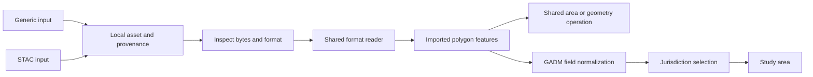

# STAC processing contracts and SHACL validation

Date: October 6, 2026. Status: ontology, N3 routing examples, executable SHACL Core validation and regression checks. The STAC browser, acquisition adapters and processing dispatcher remain proposed application features.

Fieldwork will offer Generic input and STAC input configurations that supply shared dataset contracts. STAC describes discovery; GADM describes provider conventions. Neither replaces a file format, geometry model or processing operation. This extension makes those distinctions explicit and adds validation to the [jurisdiction asset model](14-gadm-jurisdiction-assets.md).

## A56 Map STAC metadata without treating it as acquired data

The [STAC profile](../../ontology/stac.ttl) uses a Fieldwork-owned namespace, `urn:fieldwork:stac:`. It is an application mapping, not an official STAC ontology or a replacement JSON-LD context. Catalogs align with DCAT Catalogs, Collections with datasets, Items with metadata entities and Assets with distributions. An Item footprint describes asset coverage; it is not automatically a jurisdiction boundary. [STAC specification](https://github.com/radiantearth/stac-spec)

| Source metadata | RDF mapping |
| --- | --- |
| Catalog, Collection, Item ID | `dcterms:identifier` on a source-scoped IRI |
| `stac_version` | `stac:version`, separate from the dataset's `dcat:version` |
| Catalog hierarchy and Item collection | `stac:child`, `stac:item`, `stac:collection` |
| Asset dictionary entry | Owner-scoped `stac:Asset`, `stac:assetKey`, `stac:assetOwner` |
| Asset href | Preserve `stac:originalHref`; resolve against `stac:sourceDocument` into `dcat:downloadURL` |
| Roles, declared MIME, extensions | `stac:role`, `stac:mediaType`, `stac:extension` |
| Item time | `stac:datetime`, or `stac:startDatetime` and `stac:endDatetime` |
| Geometry or JSON null | `stac:footprint` pointing to geometry, or explicit `stac:geometryIsNull true` |

Preserve original JSON, bbox, extension fields, arbitrary links and source provenance even where this profile does not map them individually. Item IDs are scoped to their collection or source catalog; asset keys are scoped to their owner. Names and asset keys are not global identifiers. Relative URLs require the original document base; a local file path cannot stand in for a remote base URL.

Acquisition produces a distinct `fw:DownloadedAsset`, with byte identity and provenance back to its source descriptor. A MIME declaration, extension or STAC role never establishes that a file is available locally or has a verified format. STAC discovery does not bypass CORS or provide offline asset storage.

## A57 Reuse readers and specialize provider interpretation

The [processing vocabulary](../../ontology/processing.ttl) describes operation input/output kinds, optional format or provider requirements, required input shapes and implementation status. The supplied contracts are proposed capabilities, not registrations of working browser implementations.



An `fw:ImportedFeatureDataset` can exist before jurisdiction normalization. `fw:ImportedBoundaryDataset` specializes it after source identity and boundary-version relationships are available. Generic polygon processing needs geometry, not GADM identifiers. GADM normalization additionally interprets original attributes and produces jurisdiction semantics; it does not replace generic geometry routines.

The [N3 routing rules](../../ontology/rules/processing-routing.n3) derive only `fw:candidateOperation`, scoped to a routing request. Byte-reader routing requires a locally available acquired asset and a completed inspection of that same asset. Dataset routing requires a completed import and a compatible data kind. Profile routing additionally requires the corresponding profile. Missing evidence produces no candidate; it does not produce an automatic error classification or exclusion.

Before execution, validate the candidate's input shape, confirm a compatible installed implementation, resolve required layer/CRS/parameters, recheck asset availability and digest, and enforce resource limits. No rule derives execution readiness, starts a download, or invokes a computation. Specialized operations supplement shared operations rather than displacing them.

## A58 Validate graph structure with SHACL Core

The [shapes directory](../../ontology/shapes/) contains four files:

| Shapes | Checks |
| --- | --- |
| `assets-jurisdictions.ttl` | Digests, byte counts, acquisition lineage, jurisdiction identity, dataset release, geometry representation, GADM levels, CRS/layer records and selection inputs. |
| `stac.ttl` | Identifiers, source-document links, owner types, asset keys, HTTP(S) asset URLs, instant/interval time and footprint/null alternatives. |
| `processing.ttl` | Contract requirements, loaded input-shape references, routing modes, request inputs and matching inspection identities. |
| `selection-result.ttl` | After reasoning, exact equality of requested and produced members and distinct study-area snapshots per selection execution. |

These are executable [SHACL Core](https://www.w3.org/TR/shacl/) shapes. The development runner uses pinned `n3` and `rdf-validate-shacl` dependencies, with no remote ontology imports or SHACL-SPARQL requirement. The libraries are development dependencies and are not added to the browser bundle. [Validator documentation](https://github.com/zazuko/rdf-validate-shacl)

For candidate routes present in the input graph, the runner binds each operation's declared input shape to that request's input with `sh:targetNode`, then runs the same validator. Unknown input-shape references fail. This is validation orchestration, not workflow execution.

Post-selection validation is a separate phase. Positive N3 rules can produce a partial result when an identifier cannot be resolved; the result shape rejects the mismatch instead of treating that partial result as a completed study area. Both missing and unexpected members fail.

These shapes validate this RDF profile, not full STAC JSON conformance. Upstream JSON Schema and extension validation remain necessary before mapping. Collection extents, bbox consistency, duplicate owner/key pairs, cross-provider identity, CRS authenticity, GADM field-to-level interpretation, checksum verification against actual bytes, polygon topology and resource costs require separate checks. WKT datatype conformance does not prove geometric validity. HTTP(S)-only asset links are a Fieldwork acquisition-profile restriction, not a general STAC restriction; other URI schemes need an adapter. A graph claiming successful inspection is not independent proof that inspection occurred.

## Running and evaluating the examples

Run the supplied examples and produce JSON plus RDF validation reports:

```sh
npm run validate:ontology
```

Reports are written to `test-results/ontology-validation.json` and `.ttl`, which remain ignored by Git. To validate other RDF data, pass all related files needed to resolve references:

```sh
npm run validate:ontology -- data.ttl
npm run validate:ontology -- --post-selection data-and-conclusions.ttl
```

The second form expects selection conclusions already merged with their inputs. The CLI does not run EYE; the browser regression scenario runs EYE and then validates the merged graph. Default examples are pre-selection plans, so adding `--post-selection` without conclusions deliberately fails. Nonconformance or parsing errors exit nonzero.

The [worked STAC graph](../../ontology/examples/stac-processing.ttl) is synthetic and uses the previous synthetic boundary files. It asserts no real GADM STAC endpoint. Both generic and STAC-discovered examples reach the same GeoJSON reader; only the profiled dataset gains the GADM normalization candidate, while both retain a shared polygon operation.

Regression checks include deliberate missing/bad digests, invalid identity and levels, absent CRS, broken asset ownership, unresolved links, reversed/incomplete time intervals, unavailable bytes, mismatched inspections, incompatible contracts and incomplete selections. Practitioner evaluation should ask whether a candidate operation is understood as a proposal rather than an executed result, and whether source-specific normalization is distinguishable from generic geometry processing.

The final local `npm run check` gate passed on October 6, 2026: strict TypeScript checks, production build, 44 unit tests and 31 Chromium scenarios (2.5 minutes for the browser suite). This includes six SHACL test groups with valid and deliberately invalid graphs, and two EYE routing scenarios. The CLI was also checked for exit 0 on valid examples and exit 1 with JSON/RDF reports on an incomplete post-selection graph. Documentation links and whitespace checks passed. Browser evidence is Chromium only; these new checks have not run in remote CI.
