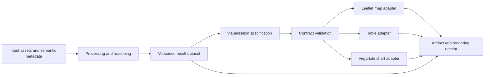

# Shared semantics for maps, charts and tables

Date: October 6, 2026. Status: proposed design specification. This document does not add an ontology, SHACL shapes, chart library or new UI behavior. Existing map, table and worked-example chart outputs remain the implementation baseline.

## Purpose and scope

Fieldwork should describe what a visualization means, how it is configured, and which workflow results produced it. Maps, charts and tables should share dataset identity, field semantics, categories, units and evidence while retaining their different presentation requirements. Practitioners should configure familiar widgets; the application should produce inspectable semantic descriptions and renderer specifications.

The first implementation should cover existing point/boundary maps and point tables plus a bounded chart adapter. It should support local execution and portable run evidence. Arbitrary chart programming, general dashboard authoring, linked brushing, new raster rendering and automatic selection of scientifically appropriate visualizations are subsequent work.

Related designs: [map layers and attributes](04-map-layers-and-attribute-contracts.md), [point tables](08-point-table-output.md), [N3 evaluation](11-n3-output-evaluation.md), [evidence references](13-node-evidence-references.md), [jurisdiction assets](14-gadm-jurisdiction-assets.md), and [STAC processing contracts](15-stac-processing-shacl.md).

## A59 Reuse vocabularies by responsibility

No single vocabulary is selected as a complete visualization ontology. Adopt a small Fieldwork application profile connecting established data and provenance vocabularies to presentation specifications. Import or map only terms with a demonstrated use, documented meaning and compatible reuse terms.

| Responsibility | Candidate vocabulary or specification | Proposed use and boundary |
| --- | --- | --- |
| Geographic meaning | [OGC GeoSPARQL 1.1](https://docs.ogc.org/is/22-047r1/22-047r1.html) | Features, geometries and spatial relationships. Keep source geometry CRS distinct from map display CRS. |
| Tabular structure | [W3C CSVW](https://www.w3.org/TR/tabular-metadata/) | Tables, columns, datatypes, missing-value declarations and identifiers. Map existing typed attributes into a bounded profile. |
| Statistical meaning | [W3C RDF Data Cube](https://www.w3.org/TR/vocab-data-cube/) | Dimensions, measures and qualifying attributes for statistical datasets, such as counts by jurisdiction and week. Do not require every input table to be a cube. |
| Quantities and units | [QUDT](https://qudt.org/) | Quantity kinds and units for values, axes and legends. Compatibility metadata does not itself perform unit conversion. |
| Category identity | [W3C SKOS](https://www.w3.org/TR/skos-reference/) | Stable concepts, labels and code lists shared across views. Colors belong to a presentation scheme, not to the intrinsic definition of a category. |
| Dataset discovery | [W3C DCAT 3](https://www.w3.org/TR/vocab-dcat-3/) and the local STAC profile | Reuse source and asset descriptions. A STAC footprint is not automatically a study boundary or a displayed data layer. |
| Execution and evidence | [W3C PROV-O](https://www.w3.org/TR/prov-o/) and [Dublin Core Terms](https://www.dublincore.org/specifications/dublin-core/dcmi-terms/) | Plans, activities, generated entities, source derivation and citations. |
| Map portrayal | [OGC Testbed-13 Semantic Portrayal](https://docs.ogc.org/per/17-045.html) | Evaluate reuse of layer, style, rule, symbolizer and legend concepts. These are engineering-report ontologies, not a supported renderer or a normative production contract. |
| Map styling alignment | [OGC Cartographic Symbology](https://github.com/opengeospatial/cartographic-symbology) | Align with styles, selectors and symbolizers. Distinguish published SymCore 1.0 from subsequent working drafts; these conceptual models and encodings are not themselves an RDF ontology. |
| Chart rendering | [Vega-Lite](https://vega.github.io/vega-lite/docs/) | Initial candidate executable JSON grammar for charts. Vega offers a possible later extension for more complex views. Neither is an RDF ontology. |
| Research comparison | [VISO](https://mmt.inf.tu-dresden.de/VO) and [Narrative Cartography Ontology](https://github.com/RightBank/narrative-cartography-ontology) | Evaluate graphic representation, task and map-content patterns. Do not make either a runtime dependency without a concrete need and artifact/license review. |

The first implementation must record the exact vocabulary artifacts, versions, licenses and mapping decisions it uses. Avoid unverified equivalence assertions such as `owl:equivalentClass`. Remote ontology resolution must not be required to open a saved visualization offline.

## A60 Separate configuration, execution and artifact

The proposed conceptual model has three distinct identities:

| Entity | Meaning | Proposed alignment |
| --- | --- | --- |
| Visualization specification | Versioned configuration of sources, fields, presentation and interaction | `prov:Plan`, which is also a `prov:Entity` |
| Rendering activity | One execution of a renderer against a particular specification and input snapshot | `prov:Activity` |
| Visualization artifact | Result manifest and, when exported, SVG/PNG/HTML or another concrete representation | `prov:Entity`, generated by the rendering activity |

Names in this document are conceptual proposals, not newly declared ontology terms. The existing `fw:MapView` and `fw:TableView` are activity classes. Preserve that meaning and existing receipts; introduce separate specification and artifact classes rather than silently retyping those classes.

Use `prov:used` to link the rendering activity to its specification and exact input entities, `prov:wasGeneratedBy` for artifacts, and `prov:wasDerivedFrom` for artifact derivation. Record the renderer as a software agent with its version. Where a qualified association is used, connect the plan through `prov:hadPlan`. Supporting references retain the existing citation role and passage locator model; a citation does not prove the visualization or its source claims correct.

## A61 Share the data contract and specialize presentation

Every specification must identify a stable source dataset or result snapshot, a schema version, a view type, a title, and the fields or geometry it consumes. Field bindings use stable identifiers rather than display labels. A label change must not silently bind a chart to another field. Composed views must define ordering explicitly; RDF triple order is not layer order.

| Shared configuration | Map-specific configuration | Chart/table configuration |
| --- | --- | --- |
| Source identities and field bindings | Ordered layers and visibility | Chart mark and field-to-channel bindings |
| Units and category concepts | Source geometry and display CRS | Quantitative, temporal, nominal or ordinal encoding |
| Explicit filters and missing-value policy | View extent and per-layer style | Axes, scales, sort order and optional facets |
| Category-to-color scheme and labels | Legend and symbolizers | Legends or ordered table columns |
| References and accessibility text | Coordinate-free records listed separately | Paging, formatting and selection behavior |

A shared palette must bind category identifiers to colors explicitly, including unknown or missing categories. Do not rely on a renderer assigning colors by row order. Pair color with labels, shapes or other cues where appropriate. Legends must explain missing, excluded and unassessed records without suggesting that they are equivalent.

Map extent controls presentation. It does not change study-area membership, clip source assets, or exclude observations. In a study spanning disconnected jurisdictions, preserve individual identities and extents; avoid interpreting a global enclosing rectangle as the analytical boundary.

Initial practitioner controls should include source, chart type, X/Y fields, grouping, title and display units. Map controls retain boundary/layer connections and styling. Tables retain column selection and record inspection. The inspector should explain unavailable options using the actual field contract, such as "Choose a numeric field for this axis."

## A62 Keep analytical computation traceable

Processing nodes should produce reusable classifications and analytical summaries. Presentation adapters should consume these results. In particular, rates, denominators, aggregation, confidence intervals, smoothing, exclusions and unit conversions must not become undocumented renderer transformations.

A convenience control such as "count by district" may eventually create an explicit derived-data operation. Its grouping, count semantics, missing-value policy and output identity must be recorded. Formatting, layout and declared display filtering remain presentation concerns, with enough metadata to distinguish the displayed subset from the full input.

N3 can derive candidate visualizations from known field roles and data kinds. A candidate is not proof of renderer availability or scientific suitability. EYE need not execute for a simple direct-data view. Numerical transformations remain computations with their own method and provenance.

The current map can compute direct-input spatial relations for display. Preserve that behavior during migration and identify its derivation in the receipt. When a coverage result is connected, use that result consistently across map and table. A future shared relation operation can consolidate the direct-map calculation without changing its meaning. Outside-boundary status never by itself means a data-quality error.

## A63 Use a bounded renderer bridge

The initial chart adapter should translate a supported Fieldwork profile into a pinned Vega-Lite JSON schema version, validate that JSON, and render supplied local data. Begin with bar, line and scatter charts; unsupported combinations must produce an actionable error rather than silently dropping configuration.

The RDF profile describes source identity, semantic bindings, units, presentation intent and provenance. Preserve the generated renderer specification as a versioned artifact. Do not attempt to mirror every Vega-Lite property in RDF or promise arbitrary JSON-to-RDF round trips. Importing arbitrary external chart specifications is outside the initial contract.

Use bundled renderer dependencies and local dataset bindings for offline execution. The adapter should not emit remote data URLs or require a CDN. External fonts, images and map basemaps need an explicit availability policy; unavailable resources must not prevent inspection of locally stored data. Existing online basemap behavior remains a separate concern.

Bulk rows and geometries can remain in local tables, arrays or stored assets. The semantic graph describes their schema, identity and provenance without requiring a triple for every plotted value. Record content digests and row counts where concrete snapshots exist; a browser-local locator alone is not a portable identity.

Define row, geometry, mark-count and export-size budgets before enabling the adapter. Exact limits require measurement and are not set by this document. If sampling or downsampling is needed, make it explicit, reproducible and visible in the result. Preserve access to the underlying table. Cancellation and large-data handling should follow the [geoprocessing memory lifecycle](06-geoprocessing-memory-lifecycle.md); no WASM requirement is introduced for chart rendering.

## Validation and proposed SHACL contracts

Validation is layered. The existing [SHACL tooling](15-stac-processing-shacl.md) provides a development foundation; it does not currently validate visualization specifications in the browser.

| Layer | Proposed checks | What it cannot establish |
| --- | --- | --- |
| SHACL Core | Required sources, view kind, bindings, units, ordered layer entries and allowed configuration combinations | Actual row validity, rendered appearance or analytical correctness |
| Application contract checks | Resolve each field in the selected source schema; check geometry, types, unit conversion support, missing values and limits | Scientific appropriateness of the chosen measure |
| Renderer JSON Schema | Generated specification conforms to the pinned supported Vega-Lite schema | Existence of referenced data fields or accessibility of the result |
| Runtime and browser tests | Expected marks, labels, axes, legends, interactions, table equivalence and offline behavior | Practitioner comprehension or successful public-health decisions |
| Practitioner evaluation | Interpretability, error recovery and ability to trace evidence | General effectiveness beyond the evaluated tasks and participants |

Proposed shapes should cover the specification, layer/channel binding, category scheme and rendering receipt separately. Constraints comparing a field binding with a source's declared schema may require prepared validation targets or application checks; do not assume SHACL Core performs arbitrary relational joins. Separate pre-render configuration validation from post-render receipt validation.

Errors should identify the responsible node and field, state the problem and give a recovery action. Keep them visible in the inspector and result panel. A failed new render must not replace an earlier successful result without explanation; clearly label retained artifacts with their original run and stale status.

## Worked design experiment

Use a synthetic screening dataset with stable jurisdiction IDs, reporting week, screening count and optional population denominator. Declare whether the count represents screening events or distinct people. Use explicitly versioned jurisdiction geometry for the map join; names alone are insufficient.

1. Import or generate the observations and inspect their schema, units and provenance.
2. Aggregate screening events by jurisdiction and week through a recorded processing step.
3. Connect the result to a line chart by week, a bar chart comparing jurisdictions, a table and a map for one selected week.
4. Apply a shared jurisdiction category scheme to categorical charts. Use a separate quantitative count scale on the map; do not imply that a jurisdiction color encodes magnitude.
5. Inspect one chart mark, map feature and table row and verify that their references resolve to the same result keys and supporting inputs.
6. Introduce a missing week, unknown jurisdiction, renamed display label, absent coordinate, incompatible unit and changed input snapshot. Observe explanations and recovery.
7. Export the workflow and result evidence, reopen offline in a fresh context, and verify data identity and equivalent presentation semantics.

Counts and rates are separate measures. If a rate is requested, require an explicit denominator, population/time alignment and scale factor in a computation node. A missing denominator produces an uncomputed result with an explanation, not zero. A missing reporting week must not silently appear as an observed zero or an uninterrupted line without a declared policy.

Acceptance evidence should include:

- Valid and deliberately invalid RDF configuration fixtures, with expected SHACL reports.
- Adapter tests asserting field bindings, category assignments, filters and generated JSON against independent expectations.
- Browser checks for actual rendering, missing-value behavior, source inspection, saved-workflow compatibility, export/import, cancellation and offline reopening.
- Cross-view agreement on a fixed selected period and source snapshot; compare exact tabular values before visual appearance.
- Provenance checks distinguishing specification edits, processing runs and rerendering, including changed labels without changed field identity.
- A practitioner task record capturing interpretation mistakes, assistance needed, correction steps and ability to distinguish unknown, outside and excluded records.

Use semantic and numerical assertions rather than pixel-identical screenshots as the primary cross-platform criterion. Record the browsers actually tested; Chromium evidence does not establish Firefox or Safari compatibility. No acceptance tests or practitioner evaluation described here have been executed for this proposed profile.

## Implementation sequence and open decisions

The [workflow publication products extension](17-workflow-publication-products.md) proposes composing these visualizations into field reports, story maps, infographics and dashboards, with versioned templates and traceable result bindings. The [communication-layer profile](36-communication-layer.md) maps detailed static/interactive maps, chart families and composed products to existing Fieldwork activities, external vocabularies and candidate local terms. The [bounded Vega-Lite Chart spike](37-vega-lite-chart-spike.md) implements one small part of this proposal; the general profile remains future work.

1. Define a minimal visualization vocabulary, mappings and SHACL fixtures for the existing map and table. Preserve current activity types and saved-workflow behavior with explicit migrations where required.
2. Build the chart adapter and a synthetic count-by-jurisdiction example. Add it to the regression gate before exposing new widgets.
3. Extend receipts and portable export to include versioned specifications, generated JSON, source identities and renderer versions. Package required data explicitly; report unavailable assets.
4. Evaluate practitioner interpretation and browser resource costs before adding coordinated interactions, broader chart grammars or automatic recommendations.

Open decisions include the exact OGC portrayal terms to reuse, whether VISO adds value beyond the selected profile, the initial renderer/schema versions, measured resource limits, and the scope of portable interactive exports. These require implementation spikes and recorded evidence. The decision in this specification is to share semantics and provenance while keeping rendering adapters replaceable.
