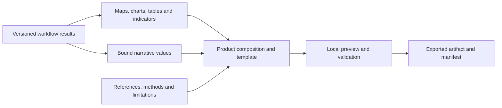

# Reports, story maps, infographics and dashboards

_Created 2026-10-06 · Updated 2026-10-07_

Date: October 6, 2026. Status: future-work design experiment. No publication widgets, templates, export engines or new ontology terms are implemented by this document.

## Developmental evaluation insight

The workflow pipeline should support communication products as end products, alongside individual maps, charts and tables. A practitioner should be able to turn a completed analysis into a field report, story map, infographic or dashboard while preserving the connection between displayed findings, underlying results, assumptions and supporting evidence.

This extends the [shared visualization design](16-semantic-visualization-design.md), [communication-layer profile](36-communication-layer.md) and [widget registry](../../widgets/README.md). The key design hypothesis is that composing products from traceable workflow results will reduce manual transcription and make findings easier to inspect and update. That benefit remains to be evaluated; producing an attractive artifact does not establish scientific validity or reader understanding.

## A64 Compose workflow products from reusable blocks

Use a shared composition model with templates for different products, rather than four independent implementations of data binding and provenance.

| Product | Typical structure | Distinct requirements |
| --- | --- | --- |
| Field report | Setting, methods, findings, maps, tables, limitations, references | Section order, pagination, captions, numbered references and a stable printable snapshot |
| Story map | Ordered narrative sections with map views, charts and evidence | Explicit map extent/time per scene, accessible navigation and a readable static alternative |
| Infographic | Selected indicators, explanatory text and compact visual panels | Explicit units and denominators, visible uncertainty, legible export and source attribution |
| Dashboard | Indicators, maps, charts and tables with shared controls | Defined filter scope, linked selections, empty states and a visible run/update timestamp |

Reusable blocks should include narrative text, computed indicators, maps, charts, tables, methods, limitations, citations and media. A block references a source result and its presentation specification; it should not copy a number into untracked text. Narrative passages may bind to measures through typed placeholders. For example, a screening total should refer to a specific count result, reporting period and jurisdiction selection.

Existing visualization output nodes are terminal today. Composition will require a new artifact/reference output contract or an equivalent explicit dependency mechanism. Do not imply that a report node can already connect to existing Map or Table outputs. Design that contract before adding connectors, and keep it distinct from raw data and decision ports.

## A65 Preserve product identity and evidence

Follow the existing proposed plan/activity/artifact distinction. A product specification describes the template, ordered blocks, result bindings, filters, audience and export settings. A composition or export activity uses a particular specification and input snapshots. Its generated artifact has a separate identity and provenance.

Align those roles with PROV and reuse Dublin Core metadata for titles, creators and references. Reuse visualization contracts for maps and charts. Local names such as ProductSpecification, NarrativeBlock and ResultBinding are candidate concepts, not declarations of standardized or implemented classes. An ontology review should determine additional terms before implementation; this design does not select a document-format or publishing library.

Each exported product should carry a manifest recording:

- Product specification and template identifiers and versions.
- Widget, renderer and ruleset versions where available, without inventing versions for legacy unpinned workflows.
- Referenced dataset/result identities, run identifiers and digests of packaged assets.
- Filter state, geographic and temporal scope, units, denominators and transformations affecting displayed values.
- Supporting references and source locators, plus authored methods and limitations.
- Export time, format and any missing or externally dependent resources.

Record authored interpretations separately from computed assertions. A finding in prose should link to its supporting result; attaching a citation does not verify the claim. Any future generated narrative should be an identifiable draft with its generation provenance and an explicit review state. Text generation is not a prerequisite for this work.

Rerunning the workflow must not silently alter an exported report. Preserve exports as snapshots. A working product can report that newer inputs exist and offer a refresh, recording a new version. A dashboard can follow the latest successful run only under an explicit update policy and must display which run it currently shows.

## A66 Separate product filters from analytical decisions

Shared dashboard controls need declared targets and compatible field identities. Filtering one panel must not silently change another panel's denominator or mix reporting periods. Store interactive state in exports when it changes the interpretation of a view.

Story-map scenes may zoom to different jurisdictions while retaining the same analytical study area. An infographic may show a subset of findings, but its selection and omissions should be identifiable. Report pagination and shortened tables must disclose truncation and provide access to the full result where included.

Unknown values, absent observations and observed zeros must remain distinct across every format. Retain material uncertainty and caveats when switching from an interactive result to a static image. Public-health decision classifications must retain their original meaning; a review flag must not become an unqualified risk claim in a caption.

## Local use, portability and publication

Build local preview and export first. Candidate outputs include HTML, printable/PDF reports, static SVG/PNG graphics and packaged interactive products; these are targets for evaluation, not commitments to particular libraries or browser support.

Package required assets deliberately within measured size budgets. Distinguish a self-contained artifact from an export that references external tiles, images or documents. An offline story map should retain local geometry, labels and narrative even when its online basemap is unavailable. Do not automatically package raw observations or attached PDFs merely because a chart cites them; allow an explicit export-content selection and list what the package contains.

Producing a local artifact does not publish it to a website or send it to others. Hosting, access control and automated distribution are separate future operations. Source attribution and reuse terms travel with included assets.

Accessibility requirements include text alternatives, meaningful reading order, keyboard access for interactive controls, labels beyond color, and accessible tabular alternatives. Test exported products as well as their preview. A PDF export is not automatically an accessible PDF, and an interactive HTML export is not automatically portable across browsers.

## Widget registry and validation implications

Future composition widgets should have independent releases in the registry. Version templates separately from their widget implementation and from the scientific rulesets producing the results. A template change that alters the interpretation of a measure requires compatibility review, even if it only appears to rearrange content.

The current registry inventories implemented widgets; keep these candidates in this design until its validation model supports proposed entries. When implemented, record input/artifact contracts, ontology mappings, export dependencies, supported formats and migrations. Do not make catalog registration evidence of an available exporter.

Proposed SHACL checks should cover product identity, block types and ordering, required result bindings, compatible specification references and provenance completeness. Application checks must resolve actual assets and fields, enforce resource limits and detect incompatible filter scope. Rendering tests must check layout, clipping, pagination, legends and static alternatives. None of these alone verifies the truth of a narrative claim.

## First experiment and acceptance evidence

Start with a field report for the spatial coverage exercise. It should contain the selected study area, input record count, inside/outside/missing-location counts, coverage map, review table, recorded exclusions and reasons, methods and source references. Counts must state whether they refer to all supplied records or the reviewed analytical subset. Missing-coordinate records must appear in the table even though they cannot appear as map points.

1. Run a small fixture with known boundary, outside and missing-coordinate cases.
2. Assemble and preview a report using bindings to those results.
3. Compare every indicator and table total with independent expected values; inspect the source of a narrative value.
4. Change the boundary or a review decision and rerun. Verify that the working product identifies stale content while the prior export remains unchanged.
5. Export, reopen offline, and inspect captions, references, missing-resource notices, reading order and pagination.
6. Ask practitioners to explain an outside record, an exclusion and an unknown location using the product and its evidence links. Record errors, assistance and recovery steps.

After this slice, reuse the blocks in a short story map, an infographic summary and a dashboard. Compare cross-product numerical consistency, time to create/update a product, traceability of claims, comprehension of limitations, offline completeness and browser resource use. Report technical conformance separately from practitioner-effectiveness evidence.

Open decisions include artifact connector design, portable export formats, document/graphics engines, template authoring, filter coordination, accessible export support and measured resource budgets. No runtime or user evaluation of this extension has been performed.
