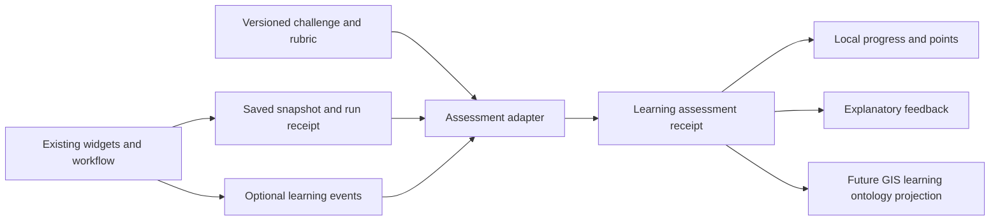

# Learning through workflow construction

_Created 2026-10-06 · Updated 2026-10-08_

Date: October 6, 2026. Updated: October 7, 2026 (A96: worked examples packaged as games). Status: proposed design experiment. This document does not implement points, assessment, learner tracking, badges, new ontology terms or registry fields.

## Purpose and first boundary

Turn construction of a meaningful GIS workflow into visible learning progress. Connecting nodes can demonstrate recognition of data types and processing dependencies; successful execution, interpretation and transfer provide stronger evidence. The hypothesis is that explicit challenges and explanatory feedback help practitioners understand why a workflow works. More connections or higher scores alone do not establish understanding.

Begin with one optional Old Naledi raster exercise: **predict -> connect -> run -> inspect -> explain -> transfer**. Keep the ordinary workspace fully usable without learning mode. Do not add a general learning-management system, classroom administration, leaderboard, automated essay grader or adaptive recommendation engine to the first slice. This follows the bounded scope in [the raster experiment](25-raster-input-and-clipping.md).

## A87 Separate scientific work from learning evidence

Maintain three related but distinct records:

| Record | Owns | Must not imply |
| --- | --- | --- |
| Scientific workflow | Sources, parameters, geometry, computations, N3 rules, results and provenance | That the learner understands the analysis |
| Learning evidence | Challenge, prediction, actions, explanations, assistance, artifact references and assessments | That a valid public-health conclusion follows from task completion |
| Motivation and progress | Points, milestone acknowledgments and optional local achievement summaries | Certification, professional competence or scientific approval |

Learning assessment reads snapshots and receipts; it must not mutate scientific facts or change computation results to make a challenge pass. Learning N3 uses a separate graph and reasoner request from scientific N3. A rubric may assess whether a learner identifies uncertainty; it cannot turn that uncertainty into an accepted scientific result.

The scientific workflow graph is also not a prerequisite graph. A data dependency from Raster input to Clip raster describes execution. A competency prerequisite such as understanding NoData before interpreting a population total describes instruction. Relate them explicitly rather than equating their edges.

## A88 Incorporation framework



Start with a small deterministic TypeScript assessment layer around the existing application. Keep domain meaning in versioned GIS challenge definitions rather than in a universal scoring engine. N3 may later express inspectable positive eligibility rules; it does not need to replace ordinary transaction, uniqueness or persistence logic.

Proposed components and integration seams:

| Component | Responsibility | Existing anchor / future boundary |
| --- | --- | --- |
| Challenge definition | Scenario, objectives, allowed evidence, rubric, hints, transfer task and point caps | New optional learning content; independent version from widgets |
| Widget learning profile | Maps supported actions and artifacts to competency IDs | Companion to the [widget registry](../../widgets/README.md) |
| Event adapter | Records committed edits, submitted answers and completed runs | After successful application persistence; not raw React Flow mouse movements |
| Assessment adapter | Evaluates explicit criteria against a pinned snapshot and run | Read-only use of core validation and run receipts |
| Receipt and award ledger | Stores judgments, reasons, versions and idempotent awards | Separate browser-local learning store |
| Learning panel | Presents prediction, progress, hints, evidence and next challenge | Optional panel; ordinary maps and results remain unchanged |

A connection earns a construction milestone only if its typed ports are compatible and it fulfills the selected challenge's intended dependency. Renaming nodes does not change eligibility. Inspector selection and keyboard-accessible connection alternatives must count the same as dragging. Merely loading an example or importing a completed workflow records an imported artifact, not learner-authored construction.

For the first pilot, observe only submitted predictions/explanations, committed relevant edits, hint requests, assessment requests and completed runs. Avoid continuous interaction telemetry. A failed storage write creates no persisted learning success. The learning adapter failing must not prevent saving or running scientific work; instead show that progress could not be recorded and allow retry.

### Proposed event and receipt contracts

A LearningEvent needs a UUID, local learner IRI, attempt IRI, event type, workflow snapshot digest, relevant node/port IDs, local timestamp and sequence, origin (manual, imported, restored or generated), and assistance context. A run event also references the exact run receipt. Do not use timestamps alone to establish ordering or identity.

An AssessmentReceipt needs an ID, attempt and criterion IDs, challenge/rubric/profile versions and digests, implementation revision, evidence references, explicit status, reason, assessment method, assistance context and creation time. Status is one of **satisfied**, **not-yet-satisfied**, **insufficient-evidence**, **not-assessed** or **unsupported-version**. A receipt is a judgment about a bounded task, not a permanent property of the person.

An Award references a satisfied receipt, milestone, award slot, points and scoring-policy version. The ledger enforces uniqueness atomically. Imported score totals are never authoritative; verify their underlying receipts and supported versions before including them in a local summary. Local integrity checks do not make this a tamper-proof examination system.

## A89 Points follow milestones, not clicks

The following is a trial rubric, not a validated scale. Base maximum: **70 points** for this exercise family under one scoring-policy version. A96 proposes a separately versioned, capped independence bonus for a game variant; it does not change awards under this original policy.

| Milestone | Evidence and assessment boundary | Trial points |
| --- | --- | ---: |
| Define the study area | Saved valid, labeled boundary; learner can identify its purpose. Shape validity does not establish scientific suitability. | 5 |
| Connect raster input | Learner-authored compatible connection to the intended source dependency | 5 |
| Document the source | Source URL/identifier and citation present, plus recognition that website metadata differs from TIFF tags; presence alone does not verify a citation | 10 |
| Clip successfully | Completed run with the intended source and polygon, expected native grid and mask behavior | 10 |
| Inspect the map | Correct response to a concrete result question; merely opening the Map earns no inspection credit | 5 |
| Explain NoData | Rubric distinguishes outside-mask/missing values from valid zero, using a counterexample | 15 |
| Diagnose insufficient coverage | In a supplied faulty scenario, identify why a larger retained window is needed and correct it without inventing data | 20 |

Award at most once per local learner, exercise family, milestone and scoring-policy version. Multiple legitimate attempts remain available without accumulating repeat points. Reconnecting, duplicating nodes, undo/redo, repeated runs, reloading and reimporting do not create additional award slots. Starting a new attempt does not reset the cap; transfer is a separately defined assessment rather than a points multiplier.

A first valid connection is modest evidence of construction. Use separate progress descriptions such as **attempted**, **practiced with support**, **demonstrated in this task** and **transferred to a new task**. Do not infer mastery from a numeric threshold. Record hints and assistance without deducting base points; a guided success remains valuable but does not satisfy an independent-transfer criterion. A96's proposed bonus recognizes separately evidenced independence, not simply hiding the guide.

Mistakes incur no negative points, time penalties or broken streaks. Diagnose faults in supplied scenarios rather than rewarding creation of arbitrary errors. Avoid speed bonuses, which confound prior familiarity, accessibility and available hardware with understanding. Points can be hidden while explanatory feedback remains available.

Completed learning history survives later edits to the scientific workflow. The current workflow's completion checklist may become stale until rerun, while the historical assessment still describes its original snapshot. A corrected or invalidated assessment is superseded with a reason; the active score projection excludes withdrawn awards. Never silently rewrite the original receipt or retrospectively rescore it under a new policy. Rubric upgrades do not automatically mint another set of points; define an explicit migration or keep summaries separated by version.

## A90 Future GIS learning ontology

Use a proposed local namespace `urn:fieldwork:learning:` (abbreviated `fwl:` below). This is an application profile to develop and review, not an established GIS education standard. Reuse standards by role:

| Standard / existing vocabulary | Intended reuse | Limit |
| --- | --- | --- |
| [SKOS](https://www.w3.org/TR/skos-reference/) | GIS concept schemes, labels and broader/narrower/related relationships | Concept hierarchy is not a prerequisite or mastery assertion |
| [PROV-O](https://www.w3.org/TR/prov-o/) | Activities, entities, agents, derivations, attribution and versioned evidence | Provenance records a judgment's origin, not its truth |
| Existing Fieldwork + GeoSPARQL | The domain entities and operations being learned: study area, geometry, clipping, spatial relations and maps | Reference scientific entities without copying their full patient/location data into learner records |
| [1EdTech CASE](https://www.imsglobal.org/spec/CASE/v1p1/impl) | Future exchange of competency frameworks, items, associations and rubrics | An exchange specification, not a ready-made GIS ontology; identifier mappings need a tested adapter |
| [xAPI](https://github.com/adlnet/xAPI-Spec) | Future export of actor/action/object learning experiences, result and context | A local event is not automatically a conformant xAPI statement; no LRS or network reporting in this pilot |
| [SHACL](https://www.w3.org/TR/shacl/) | Proposed structural admission rules for definitions, attempts, evidence and receipts | Passing shapes does not establish learning or numerical correctness |

Conceptual classes and relationships:

| Proposed term | Alignment and key relationships |
| --- | --- |
| GISConcept | A `skos:Concept`, e.g. spatial extent, NoData or coordinate order |
| Competency | An assessable ability, linked by `aboutConcept` to concepts and by `requiresCompetency` to explicit instructional prerequisites |
| LearningObjective | Task-specific expected performance; `targetsCompetency` |
| Challenge | A `prov:Plan`; `hasObjective`, `hasCriterion`, permitted evidence and fixture references |
| WidgetLearningProfile | A `prov:Entity`; `forWidget`, `supportsCompetency`, compatible widget contract and profile version |
| Attempt | A `prov:Activity`; `prov:wasAssociatedWith` the local learner; `attemptsChallenge` |
| LearningEvent | A `prov:Entity` describing an observed action; `inAttempt`, event origin and snapshot reference |
| EvidenceArtifact | A `prov:Entity`; workflow snapshot, run receipt, prediction, explanation or diagnosis; `prov:wasGeneratedBy` the producing activity |
| AssessmentActivity | A `prov:Activity`; uses criterion, evidence and evaluator version to generate an AssessmentReceipt |
| AssessmentReceipt | A `prov:Entity`; `assessesCompetency`, `inAttempt`, `forCriterion`, `assessmentStatus`, evidence links and assistance |
| Award | A `prov:Entity`; `basedOnAssessment`, `forMilestone`, `points`, `awardKey`; distinct from the assessment itself |
| CompetencyEvidenceSummary | A revisable, provenance-linked projection over multiple assessments, including transfer and contrary evidence |

Define competencies with observable verbs: **select an appropriate extent**, **connect typed dependencies**, **distinguish crop from mask**, **interpret NoData**, **trace a source citation**, **recognize CRS/axis order**, **diagnose missing coverage**, and **explain a result's limits**. These may map to existing widget entities/activities without equating a computational class with a learning competency. Do not assert `owl:sameAs` simply because two frameworks use similar labels.

### Illustrative RDF mapping

The following Turtle is a design example only. The custom terms are not added to the executable ontology in this slice; abbreviated resources represent synthetic examples, not actual learner records.

```turtle
@prefix fwl: <urn:fieldwork:learning:> .
@prefix ex: <urn:fieldwork:learning-example:> .
@prefix fw: <urn:fieldwork:> .
@prefix prov: <http://www.w3.org/ns/prov#> .
@prefix skos: <http://www.w3.org/2004/02/skos/core#> .

ex:NoData a skos:Concept ; skos:prefLabel "NoData and valid zero"@en .
ex:InterpretMask a fwl:Competency ; fwl:aboutConcept ex:NoData .
ex:ClipProfile a fwl:WidgetLearningProfile ;
  fwl:forWidget <urn:fieldwork:widget:clip_raster> ;
  fwl:aboutOperation fw:RasterClipping ;
  fwl:supportsCompetency ex:InterpretMask .
ex:OldNalediChallenge a fwl:Challenge, prov:Plan ;
  fwl:hasCriterion ex:ExplainNoDataCriterion .
ex:Attempt1 a fwl:Attempt, prov:Activity ;
  fwl:attemptsChallenge ex:OldNalediChallenge ;
  prov:wasAssociatedWith ex:LocalLearner .
ex:LocalLearner a prov:Agent .
ex:Explanation1 a fwl:EvidenceArtifact, prov:Entity ;
  prov:wasGeneratedBy ex:Attempt1 .
ex:Review1 a fwl:AssessmentActivity, prov:Activity ;
  prov:used ex:Explanation1, ex:ExplainNoDataCriterion .
ex:Assessment1 a fwl:AssessmentReceipt, prov:Entity ;
  fwl:inAttempt ex:Attempt1 ;
  fwl:forCriterion ex:ExplainNoDataCriterion ;
  fwl:assessesCompetency ex:InterpretMask ;
  fwl:assessmentStatus fwl:Satisfied ;
  prov:wasGeneratedBy ex:Review1 ;
  prov:wasDerivedFrom ex:Explanation1 .
```

Use named graphs or equivalent separately scoped documents for published learning definitions, scientific snapshots, private learner events and assessment receipts. Durable record identifiers should be opaque UUID IRIs. Full graphs and answers stay local by default. A widget-to-competency link means the widget can provide an opportunity for evidence; it does not mean its user has that competency.

### Proposed shapes and reasoning boundary

Future shapes should require a competency target, criterion version, evidence reference, attempt, supported status and evaluator identity/method on each assessment. Require valid timestamps/digests and an award's nonnegative bounded points and satisfied-receipt reference. Use application checks for ledger uniqueness, supported executable versions, digest verification and cross-record sequencing; do not claim SHACL Core alone enforces these transactional requirements.

A future N3 rule may infer an **award candidate** from a validated satisfied assessment and eligible milestone. The application then performs the idempotent award transaction. Missing answers remain insufficient evidence, not inferred failure. Absence of an award triple in an RDF graph is not proof that no award exists in durable storage. Neither a positive N3 conclusion nor an award is a claim of general mastery.

## A91 Version learning profiles independently of widgets

Do not insert scoring weights directly into computational node parameters. A proposed companion profile identifies the stable widget IRI, supported release(s), competency IDs, observable events, evidence selectors, rubric adapter and profile digest. Challenge authors select points; changing those points should not change raster computation semantics.

The current registry does not pin executable widget versions inside saved workflows. An initial assessment must therefore capture the actual application revision plus the current release descriptor/digest at the time of the attempt. Never reconstruct that binding from a future registry's currentVersion. Until version admission exists, mark incompatible imported attempts unsupported rather than silently running today's rubric against yesterday's behavior.

Keep computational implementation, widget contract, learning profile, ontology, challenge, rubric and scoring policy versions distinct. Definitions and scoring receipts are append-only by version. A defect in a learning profile should not require changing a correctly functioning Clip raster widget. Historical descriptor files alone cannot replay old executable code.

## A92 Local storage and portability

Support one local browser-user learner, with no account or roster requirement. Learning mode is opt-in. Store its event journal, evidence references, receipts and award ledger separately from workflow localStorage, preferably with atomic IndexedDB transactions. Keep the total as a rebuildable projection. Cap retained evidence and warn before storage limits; do not silently discard the evidence needed to justify an award.

Ordinary scientific project export should omit learner history and answers. A future explicit **Include my learning record** option must preview exactly what is included and use an extended encrypted-package manifest with required artifacts/digests. Current packages do not implement this option. Import merges by durable IDs/award keys, detects conflicting records, and never doubles points. Missing evidence becomes unavailable or unsupported, not restored competence. Reset/clear/export controls must be available without deleting the scientific project.

No external LRS, teacher dashboard or analytics service is needed. Published challenge content can be cached for offline use, but personal progress remains on-device. Encrypted exports do not imply encrypted browser storage. Avoid raw participant or patient data in events; even digests and project names can be sensitive. Replay should be read-only and should neither emit fresh awards nor execute arbitrary imported assessment code.

## A93 Pilot and developmental evaluation

Use [the N3 evaluation framework](11-n3-output-evaluation.md) to separate software correctness, explanation quality and learning effectiveness.

1. **Baseline:** ask the learner to explain raster extent, polygon masking and NoData before points or hints appear.
2. **Guided Old Naledi task:** predict whether all cells in the retained rectangle will remain; connect the workflow, record source provenance, run, inspect, explain and receive criterion-specific feedback.
3. **Recovery task:** provide a deliberately undersized retained window; assess diagnosis and reacquisition. Include a genuine outside observation in a separate coverage task so learners do not learn to discard every outlier.
4. **Transfer:** use a different synthetic location, raster and polygon, hide procedural hints and change node positions/names. Assess whether the learner can construct the dependency graph and explain boundary/NoData behavior.
5. **Retention:** revisit a comparable task later. Do not equate faster mouse use or remembered menu locations with conceptual retention.

Collect prediction/explanation rubric results, independent task success, meaningful recovery, assistance requested, transfer performance and learner comments. Time can inform usability but must not drive scoring. Compare equivalent tasks with explanatory feedback alone versus feedback plus points; counterbalance task order where feasible and record prior GIS familiarity. Small developmental trials identify design problems; they do not establish a causal educational benefit or practitioner effectiveness.

Assess explanations first with structured counterexample questions and a published rubric. Free-text reflection can be stored as self-report or reviewed by an evaluator; entering text is not automatically a correct explanation. Automated semantic grading, if explored later, needs its own validation against expert judgments and a visible correction path.

### Proposed acceptance checks

- Mode off: scientific output, provenance, storage and execution remain unchanged.
- Drag, keyboard/inspector and equivalent graph layouts yield equal judgments.
- Reconnect/duplicate/reload/reimport/replay never multiply awards.
- A supplied completed example does not establish learner-authored construction.
- Failed runs, stale snapshots, missing metadata and unsupported rubric versions receive explicit non-success statuses.
- NoData/zero counterexamples and coverage faults have independently specified expected answers.
- Assistance changes the evidence label, not access to learning or raw point penalties.
- Offline save/reload/export/import preserves receipt identity and explains unavailable evidence.
- Unknown is distinct from incorrect; structure validation is distinct from competency evidence.
- Learners can hide points, navigate by keyboard, use textual equivalents to maps and avoid motion/time pressure.

## A94 Language learning as a design analogy

Constructing a GIS workflow resembles composing an expression: select meaningful elements, combine them according to structural rules, interpret the result and judge its appropriateness in context. Use this analogy to design exercises, not as evidence that language-teaching methods transfer unchanged to GIS.

| Language-learning dimension | Workflow counterpart | Evidence to seek |
| --- | --- | --- |
| Vocabulary | Study area, raster, feature, CRS, NoData and operations | Distinguishes concepts using examples and counterexamples |
| Grammar | Typed ports, required inputs and dependency order | Builds compatible connections and explains required inputs |
| Meaning | What the connected operations compute | Predicts and interprets outputs, exclusions and missing values |
| Appropriate usage in context | Fit between an analysis and its public-health question | Checks dataset year, population, units, sources and assumptions |
| Reading comprehension | Interpreting an existing workflow and its evidence | Explains a graph the learner did not construct |
| Composition | Building from an analysis question | Constructs and justifies a workflow from an empty canvas |
| Revision | Predicting, running, inspecting and correcting | Diagnoses a mismatch and explains the correction |
| Fluency and transfer | Independently adapting familiar operations | Solves a new task without depending on the original layout or hints |

A grammatically valid expression can convey an inappropriate meaning. Likewise, a workflow can pass port validation and execute successfully while using an unsuitable population year or interpreting NoData as zero. Feedback must distinguish structural errors, interpretation errors and suitability concerns. Successful execution does not automatically satisfy all three criteria.

The analogy has limits: graphs can branch and reuse intermediate results, and their meaning depends on data, parameters, coordinate systems and execution semantics. A visually identical graph can answer a different question when inputs change. Fluency means independent, justified adaptation rather than speed or reproduction of a canonical arrangement.

### Exercise progression for Old Naledi

| Stage | Exercise | Assessment boundary |
| --- | --- | --- |
| Recognize | Identify the operation that masks a raster with a polygon | Recognition does not establish construction or explanation |
| Complete | Supply a missing connection in a partial raster-clipping graph | Supplied parts do not count as learner-authored work |
| Interpret | Predict which cells survive and explain an unfamiliar completed graph | Assess comprehension independently of construction |
| Correct | Diagnose insufficient coverage, a wrong source year or NoData/zero confusion | Require a justified diagnosis and appropriate correction |
| Compose | Start with a blank canvas and a request for a cited Old Naledi raster subset | Assess connections, execution, provenance and explanation separately |
| Transfer | Adapt to another location, source and polygon without procedural hints | Require independent application rather than memorized node positions |

These are exercise forms with increasing independence, not a compulsory universal sequence. Learners may understand a graph before they can build one, or reproduce it without understanding it. Permit targeted practice without forcing experienced users through every recognition task. Retain A89's milestone caps rather than adding points for every exercise form.

### Ontology and evaluation implications

Separate the topic from the performance assessed. The concept **polygon masking** supports distinct competencies in recognizing, connecting, interpreting, diagnosing and independently applying the operation. Propose an exercise-form concept scheme containing Recognize, Complete, Interpret, Correct, Compose and Transfer, linked from challenges through a future `fwl:exerciseForm` property. Receipt criteria identify the competency, form, assistance and task context. These terms require declarations and shapes before runtime use.

Recognition is not equivalent to production. A future CompetencyEvidenceSummary should retain separate evidence dimensions, including those not assessed. Neither a SKOS hierarchy nor points from a recognition task establishes independent transfer.

Extend A93 with paired comprehension and construction tasks. Compare familiar-layout completion with rearranged graphs and a new data/location combination. Identify learners who connect correctly but cannot predict results, and learners who understand results but struggle with the interface. Collect feedback on whether the vocabulary/grammar/meaning framing clarifies reasoning; revise or discard it if it confuses participants. Educational benefit remains an evaluation hypothesis.

## A95 Workflow iteration history: a version-control analogy

Provide a local history of meaningful workflow iterations so practitioners can compare alternatives and learners can explain how their reasoning changed. The user's word "git" is an analogy: this proposal does not require Git, a remote repository, commits, publishing or a command-line interface. Use accessible labels such as **Save checkpoint**, **Compare versions**, **Try an alternative** and **Restore as a new version**.

This is distinct from the current short Undo/Redo history and project-manifest revision counter. Those support editing and inventory consistency; they are not a durable history of scientific or learning decisions. Workflow iteration IDs also differ from software/widget release versions, challenge versions and scoring-policy versions.

### What constitutes an iteration

Keep a mutable working draft and immutable checkpoints with UUIDs and content digests. A checkpoint records its parent checkpoint, workflow snapshot, asset references/digests, creation time, optional label and rationale, and application/widget contract bindings available at capture. Include source citations, parameters, geometry and connections. Record canvas layout separately so moving a node is distinguishable from changing an analysis.

Capture a checkpoint explicitly on request and automatically at execution, before the run starts. Bind success or failure receipts to that frozen checkpoint; edits made afterward belong to a newer draft. A checkpoint does not imply a successful run. Do not record every mouse movement as a new version. If the same scientific snapshot is rerun, retain separate execution receipts without pretending it is a new scientific design.

Use the scientific snapshot digest for computational identity and a separate presentation digest for layout. A stable checkpoint ID preserves historical identity even when two checkpoints have equal content. Define canonical serialization before implementation; node ordering or object-key ordering must not create spurious scientific differences.

### Compare, branch and restore

| Action | Proposed behavior | Learning opportunity |
| --- | --- | --- |
| Save checkpoint | Freeze the current workflow and optional rationale | Explain what changed and why |
| Compare versions | Show added/removed nodes and edges, changed parameters, boundaries, sources and citations | Distinguish a structural change from a scientific change |
| Compare results | Compare receipts tied to the selected versions, including missing or failed runs | Check whether the predicted effect occurred |
| Try an alternative | Create a draft descended from a selected checkpoint without replacing that checkpoint | Test a different boundary or assumption |
| Restore as a new version | Copy an earlier checkpoint into a new current checkpoint, recording its restore origin | Recover without erasing the sequence of decisions |

Start with one-parent branches and no automatic merge. Two conflicting boundary or parameter edits need an explicit choice, not a silent combination. Overlay changed boundaries or show before/after maps where useful, with a textual difference summary for accessibility. Compare result values only when units, grid alignment and measure definitions support the comparison; otherwise explain why direct subtraction is inappropriate.

For example: **v1** records the initial Old Naledi boundary and citation; **v2** expands the boundary after a coverage problem; **v3** reacquires a sufficiently large raster window and reruns the clip. The history should identify both the geometry change and the replacement asset, rather than attributing the result difference solely to clipping. An alternative branch may retain v1 for comparison.

### Storage, provenance and learning mappings

Store checkpoints and branch heads locally, with content-addressed assets deduplicated across versions. Preserve an old raster window or PDF while a retained checkpoint depends on it. Metadata-only versions can share pixel bytes. Use atomic writes for the checkpoint, required inventory and branch-head update; missing assets must be reported as incomplete history, not silently replaced with a newer file.

Default project export may continue to include the current snapshot only, clearly labeled. A future **Include workflow history** option must inventory the selected checkpoints and the union of their required assets, enforce package limits and report omissions. Historical workflows remain separate from optional learner answers and scores. Pruning history requires a preview of affected versions and evidence references; it must not leave unexplained broken assessment links. These history export and retention behaviors are proposed, not supported by the existing package format.

Model a future WorkflowSnapshot as a `prov:Entity`, a revision or restoration as a `prov:Activity`, and a parent/child revision using `prov:wasRevisionOf` when that relationship is appropriate. An alternative derives from its origin through `prov:wasDerivedFrom`; an explicit application relationship identifies the branch head. Use `prov:used` to connect a computation or assessment activity to the exact snapshot. Do not infer temporal order solely from file timestamps or version labels.

Learning events and AssessmentReceipts reference these snapshot IDs and digests. A prediction can reference the baseline, while an explanation references the comparison between two checkpoints. This creates evidence of revision and diagnosis without treating the number of versions as achievement. Branching, restoration and replay must not multiply milestone awards; A89's ledger remains authoritative for point eligibility.

### First history slice and acceptance checks

Begin with local checkpoints, a version list, a textual scientific diff and restoration as a new version. Branch visualization, spatial overlays and portable history can follow after this foundation is reliable. Do not make history infrastructure a prerequisite for the first learning panel; initial assessments can retain their own immutable snapshots until shared history is available.

- Changing node position alone produces a layout difference, not new scientific achievement.
- Undoing or restoring work does not erase prior run or learning receipts.
- A run always points to the exact input checkpoint, even if the current draft changes.
- Repeated checkpoint saves, reruns, branches and imports do not duplicate points.
- Old assets remain available while referenced, and unavailable historical assets are clearly reported.
- Restoring a workflow does not replace the learner's history or reinterpret an old assessment under a new rubric.
- Reload and offline use retain checkpoint identity; a failed write leaves the previous branch head intact.

## A96 Worked examples packaged as games

Added October 7, 2026. **Design only.** A worked example can have two entry modes: **Explore the example**, which opens the existing completed demonstration, and **Play the challenge**, which opens a new attempt with an empty workflow canvas. Preserve the learner's current scientific project; creating a game attempt must not clear an existing workspace. The learning goal is to construct, test and explain the workflow, rather than reproduce the author's layout.

The game opens with a short public-health question, desired outputs, available data, completion criteria and a choice of **Guided** or **Independent** mode. No widgets or connections are preplaced. Supporting assets may be provided in a resource tray without becoming input nodes until the learner adds and configures them. A returning learner can resume their saved canvas, notes and progress; blank-canvas startup applies to a new attempt, not every reload.

### Focused widget library and challenge package

Show only the primitives needed for the exercise and its explicitly supported alternatives. The full catalog remains available in the ordinary workspace. The reduced palette is a teaching choice, not a new set of computational widgets: it references stable widget registry identities and learning profiles. All required primitives are available from the start; chevrons guide sequencing without forcing a particular node position or click order. Multiple instances of a primitive are permitted where the task needs them. A role-to-node binding identifies which instances satisfy each step; matching a label is not sufficient.

For the initial Old Naledi raster game, the palette can contain just **Study area**, **Raster input**, **Clip raster** and **Map**. Learners define a boundary, prepare and cite a bounded raster, connect the clipping operation, and display and explain the result. Do not expose Voronoi, routing or unrelated reasoning widgets in this package. If an exercise admits two scientifically appropriate solutions, include the necessary primitives and assessment alternatives instead of requiring one hidden canonical graph. An unrestricted exploration fork may leave the bounded game rubric; make that change explicit and retain the attempt history.

A proposed game definition extends A88's challenge contract with:

| Definition field | Responsibility |
| --- | --- |
| Identity and compatibility | Game ID/version/digest, challenge/rubric/scoring-policy bindings, supported application and widget contracts |
| Scenario and starting state | Brief, desired outputs, `blank` starting canvas, supplied resource descriptors and source citations |
| Palette | Allowed widget IRIs, supported versions/profiles, necessary instance roles and accepted alternatives |
| Steps | Stable IDs, plain-language labels, instructional prerequisites, evidence selectors and completion criteria |
| Guidance | Chevron visibility default, procedural hints, assistance categories and motion preference |
| Reflection | Planning and iteration prompts, optional or assessed status, links to snapshots/runs |
| Help | Widget help cards, concept mappings and optional external notebook descriptors |
| Package inventory | Embedded or linked resources, bytes, media types, hashes, licenses and offline availability |

Reuse the [project-package manifest design](24-encrypted-project-packages.md) through a future explicit game-package profile. Check that the definition, required widget contracts, evaluators and embedded assets are supported and complete before starting. A linked URL is not an offline asset. Published game content contains no private attempts, notes or awards; personal continuation uses a separate opt-in learning-record export under A92. Imported definitions select supported local criterion evaluators; they do not supply arbitrary executable assessment code. Current JSON/encrypted ZIP formats do not yet implement this game profile.

### Optional top chevrons

Above the canvas, show a compact sequence such as:

**Define area › Prepare source › Clip › Inspect result › Explain**

The current actionable step has a gently blinking or pulsing chevron with a visible **Current step** label. Completing that step's required widget work stops its blinking and adds a checkmark. Activate the next eligible step. Instructional prerequisites belong to the game definition, separate from scientific dataflow dependencies. If several steps are eligible, recommend one current step while allowing the learner to choose another. The strip can collapse or wrap on a narrow screen.

| Step state | Display | Evidence/state transition |
| --- | --- | --- |
| Not started | Quiet label | No qualifying saved evidence yet |
| Current / in progress | Gentle blink/pulse plus text | Selected eligible step; existing partial work is retained |
| Blocked | Static reason and recovery action | A required source, supported contract or prerequisite is unavailable |
| Complete | Static checkmark; no blinking | All declared criteria satisfied against saved evidence and, where needed, a matching successful run |
| Needs recheck | Static notice | Relevant inputs, parameters or connections changed after the assessed snapshot |

Adding a widget alone does not complete every kind of step. A boundary step checks a valid saved geometry and required label; source preparation checks the expected asset and citation; a clipping step checks the intended typed dependencies, parameters and successful execution. An inspection or explanation step needs its declared response/evidence in addition to the output widget. The definition must distinguish automatically checked construction criteria, structured interpretation questions and reflection requiring review. Unassessed free text cannot silently become a correct explanation.

Persist completion receipts and assistance events after successful saves. On resume, derive current status from the saved attempt, supported definition and relevant snapshot/run digests. A failed write must not leave a permanent completion checkmark. Changes to a source or operation invalidate dependent current-step checks until reassessed; moving a node does not. Historical satisfied receipts remain attached to their old snapshots, following A89/A95. If a previously completed step needs revision, the learner can select it as current again. Finishing the whole game requires all mandatory criteria; it does not imply general GIS mastery.

Guidance can be hidden or reopened at any time without losing work. **Hide guide** changes presentation, not the underlying criteria or evidence record. Already received guidance remains part of the assistance history. Provide an explicit **Reduce motion / Stop blinking** control and respect reduced-motion preferences: use a static outlined current chevron, text and `aria-current="step"` instead. Turning off animation is not choosing Independent mode and must not affect points. All steps and hints are keyboard accessible, use more than color to convey state, and announce state changes without repeated blinking announcements or forced focus changes.

### Side notepad: plan, prototype and reflect

Provide an optional resizable/collapsible notepad beside the workbench, independent of the parameter Inspector. It encourages the learner to write a plan before constructing nodes, sketch dependencies as a short list or textual graph, predict an output, and explain revisions. On narrow screens it becomes a drawer or tab without covering Save or Run controls. Learners can keep working without a prescribed amount of writing.

Suggested prompts are **What am I trying to find out?**, **Which inputs and steps do I expect to need?**, **What do I predict?**, **What changed in this iteration?**, **Why did I change it?**, and **What did the result teach me?**

Keep a mutable planning draft with a visible local save state, plus **Save iteration note** to capture a dated entry. Each entry has an opaque ID, attempt ID, optional step/node references, parent or comparison checkpoint IDs, workflow digest, optional run receipt and learner-authored text. Attach it to A95's checkpoint history when available; until then retain the bounded snapshot needed for the note. A note about a failed run is still useful evidence of diagnosis. An automatic diff may list added/removed widgets, connections, parameters or replaced assets, but it is labeled as an application-generated summary, distinct from the learner's explanation.

For example, iteration 1 proposes a study polygon and predicts the clipped extent; iteration 2 adds Raster input and its source citation; iteration 3 adds Clip raster and Map, then records why a border gap remains; iteration 4 acquires adequate source coverage and explains the changed result. Nodes, connections and data can change between iterations without erasing earlier reasoning. Provide comparison and a final reflection on the full workflow, not points for the number of notes or revisions.

Notes stay with the one local learner and survive reload, guide toggles and supported resume/import. They remain separate from scientific source citations and public game definitions. Exporting an ordinary workflow must not unexpectedly include the learner's reflections; the optional learning-record package explicitly inventories them. Unsubmitted drafts and optional notes are not automatically assessed. If a particular reflection is required, declare its rubric and review method in advance. Do not infer understanding from word count, prose style or the mere presence of text.

### Independent mode and points

Retain A89's base milestone points for guided and independent completion alike. A game can offer **additional points for demonstrated independent completion** under a published, separately versioned scoring policy. For this proposed raster variant, trial a **10-point maximum independence bonus**, making its cap **70 base + 10 bonus = 80**. This is a candidate design weight to evaluate, not a validated measure. Original 70-point receipts remain under their original policy and are not automatically rescored.

Eligibility requires the same construction, execution and interpretation evidence, plus an assistance record showing that the assessed construction was completed without the procedural chevron guide, step walkthroughs or a revealed solution. Selecting Independent mode or hiding the strip after following it earns nothing by itself. Concept definitions, accessibility support, the notepad and ordinary widget `?` help remain available in both modes; help that reveals a task-specific procedure is explicitly tagged as procedural. Define notebook assistance similarly rather than treating all external study as disqualifying.

Taking a procedural hint changes the assistance label and eligibility for this attempt's independence bonus; it does not subtract earned base points, block help or mark the learner as having failed. State that consequence before revealing the hint. A learner can later demonstrate independence on an equivalent fresh task. Use one bonus award slot per learner/exercise family/milestone/policy binding, with explicit cross-version migration as in A89, so toggling guidance, replaying a completed artifact, branching, importing or repeating a task cannot farm extra points. Incomplete assistance history yields insufficient evidence for the bonus, not an assumption of independence. The bonus is local motivational evidence, not a tamper-proof credential or proof of transfer to a new setting.

### Widget skills, plain-language help and notebook deep dives

Link each primitive to opportunities for progressively stronger evidence: recognize its purpose, choose it, configure it, connect it, interpret its output, diagnose problems and transfer its use. Selecting or using a widget records an opportunity/action; successful assessed use supports a bounded skill claim. Multiple instances and repeated clicks do not themselves establish increasing skill. Reuse A90/A94's concept/competency/profile distinctions and [experiment 33's canvas-to-library highlighting](33-isochrone-plot-and-interactive-map.md) so learners can see the primitive behind a workflow instance.

Add a keyboard-accessible **?** button to the palette item and instantiated widget. It opens a plain-language card or dialog without adding a node, starting a drag or running a computation. Include **What this does**, **What it needs**, **What comes out**, **When to use it**, **A common mistake**, and a small example. For Clip raster: “Keep raster cells for your selected area. Supply a raster and a boundary. Outside cells become NoData; this cannot create data missing from the source.” Avoid making help depend on hover. Close/Escape returns focus to the originating help button.

Future help cards can link to external JupyterLite notebooks for deeper explanations of concepts, principles and Python implementations. A reprojection deep dive could explore coordinate reference systems, datum/axis order, why display and measurement CRSs differ, and code comparing transformed coordinates. This is a learning-resource example; it does not claim a general Reproject widget exists today.

Store a notebook resource's title, URL, publisher/source repository, pinned revision where available, relevant section, concepts/competencies, prerequisites, assistance category and offline availability in the learning profile. Open it explicitly in a separate tab after saving the local draft; do not send workflow data, credentials or private notes in its URL. External notebooks may need connectivity and have their own persistence/runtime behavior. A link click is not evidence of notebook completion or competence. A later integration can accept explicitly imported exercises/results with provenance and a compatible rubric. Bundling notebooks for offline use, executing them inside Fieldwork and sharing learner state require separate implementation decisions.

### Future ontology and assessment contracts

Extend the proposed `fwl:` profile without changing scientific GeoSPARQL facts:

| Proposed term | Mapping and purpose |
| --- | --- |
| GamePackage | Versioned `prov:Entity` that packages a Challenge, assets, profiles and scoring policy |
| ChallengeStep | Part of a Challenge plan; has criterion, instructional prerequisites and required widget roles |
| Guided / Independent | Assistance-mode concepts; record mode changes and actual procedural guidance exposure in the Attempt |
| ReflectionEntry | EvidenceArtifact linked to an Attempt, optional step and exact workflow checkpoint/run; distinguished from generated diffs |
| WidgetHelpResource | Versioned learning resource about a widget/concept, with conceptual or procedural assistance category |
| NotebookDeepDive | Learning resource with source/revision, concept/competency links and an external delivery location |

Chevron state is a rebuildable interface projection over criteria, dependencies and assessment receipts, not a mastery assertion. Future SHACL admission checks should require valid step/profile references, supported state/status vocabulary, resource identity, reflection provenance and bounded bonus definitions. Application validation must check acyclic instructional prerequisites, executable evaluator compatibility, package completeness, assistance sequencing and award uniqueness. No new ontology declarations, shapes or runtime scoring are implemented by this note.

### Bounded prototype and evaluation

Start with one game definition for Old Naledi clipping: four primitives, an empty canvas, five optional chevrons, widget help cards and a local planning/iteration notepad. Add deterministic structural/run checks and a small explicit interpretation rubric. Then add the capped bonus and recovery/portability checks. External notebook links follow as curated learning resources; embedded notebook execution is outside this first prototype.

Acceptance checks for that future implementation:

- Starting a game preserves other workspaces and produces zero preplaced nodes; resume restores the learner's work.
- The package exposes only its declared needed primitives; all required roles and accepted alternatives can be constructed.
- Chevron completion depends on declared saved evidence, not clicking Next, node labels, layout or importing a solved graph.
- Completing a step stops its animation; relevant later edits mark affected steps for recheck without deleting historical receipts.
- Guide visibility and reduced-motion settings are independent; keyboard and pointer workflows receive equivalent assessment.
- Notepad drafts and iteration links survive offline reload; failed saves stay visibly unsaved; comparison identifies actual scientific changes.
- A guided solution earns all eligible base points; an independent solution can earn its capped bonus; toggles/replays/imports do not duplicate awards.
- Clicking `?` opens help without creating or moving a widget; concept help remains accessible in both modes.
- Ordinary project export excludes private notes; optional learning export checks required artifacts and conflicting IDs before restore.
- External notebooks are clearly identified, do not receive private state automatically, and do not count as completed merely because they were opened.

Extend A93's developmental evaluation with guided and independent tasks of comparable difficulty, prior-familiarity notes and counterbalanced order where feasible. Observe whether the reduced palette aids operation choice, whether chevrons clarify dependencies or encourage unthinking recipe-following, whether the notepad captures meaningful predictions/revisions, and whether the bonus discourages needed help. Ask learners to explain and transfer the workflow after guidance is hidden. Completion rates, points and more frequent widget use remain usability/motivation indicators until interpretation and transfer evidence support a learning claim.

## Delivery slices and open decisions

**Slice 1:** one opt-in Old Naledi challenge, a small learning panel, a companion profile for Study area/Raster input/Clip raster/Map, deterministic construction/run checks and explanation prompts. Local receipts first; no ontology runtime or external service dependency.

**Slice 2:** idempotent milestone points, assistance labels, persistence and recovery tests. Evaluate whether points improve engagement or instead encourage superficial completion.

**Slice 3:** independent transfer tasks, draft `fwl:` vocabulary and SHACL fixtures, and optional isolated N3 eligibility rules with positive and negative examples.

**Slice 4:** explicitly requested encrypted learner-record portability and tested CASE/xAPI adapters. Adaptive sequencing and portable credentials require separate design decisions and evidence.

Before implementation, choose the initial competency wording and explanation rubric, identify a reference assessor for the pilot, and settle the minimum evidence retained for replay. Trial point weights remain adjustable through versioned policies. Do not use these choices to block writing or testing the first challenge definition.
