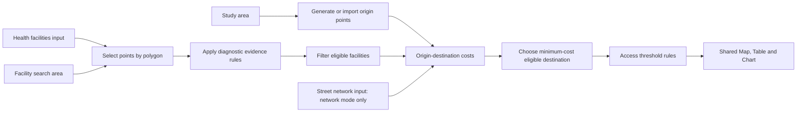

# Facility access composed from shared primitives

Date: 2026-10-07. Status: design for the next standardization slices; no runtime behavior changed by this document.

## Developmental observation

The practitioner identified that the Old Naledi diagnostic-access example still looks like a collection of special-purpose widgets. They proposed health facilities as a specialized input profile, selection through points-in-polygon, and access measured either by straight-line distance or street-network routing.

Inspection confirms partial standardization: `facilityInput` in `src/old-naledi.ts` creates an ordinary `observations` input with the 214 historical records; generated samples expose common point features; access accepts ordinary point input; outputs use shared Map, Table and Chart nodes. However, `facilities` still implements radius selection and conversion into a facility-specific structure, while `access` combines diagnostic eligibility, nearest-facility choice and distance-to-time conversion. The `xpert` rules remain tied to NB06 named-facility/type assumptions. These are the remaining composition boundaries.

## Target composition

These are conceptual boundaries. Common tasks may be presented as a reusable subworkflow with an expandable internal graph, rather than requiring a beginner to configure every primitive separately. Subworkflow UI is future work.

## Health facilities as an input-data profile

Provide a Health facilities input with source adapters for a bundled snapshot, CSV, supported GeoPackage points, Healthsites, and separately configured ministry APIs. Reuse generic parsing, mapping, attribute editing, geometry validation, credential resolution, provenance and asset storage. The output remains a common point dataset with an explicit health-facility profile so ordinary spatial and visualization nodes can consume it.

Preserve source identifiers, source field names, original values and acquisition metadata. Map fields to a canonical facility identifier, display name, location, facility type and ownership where supplied. Service assertions, operating status and dates can be unknown. Optional fields must not become universal requirements merely because the Old Naledi rule pack uses them. Convert provider-specific type/ownership vocabularies explicitly; keep unmapped values visible for review. A missing location remains a reviewable record, not an invented coordinate.

Healthsites and ministry APIs are alternative acquisition adapters, not separate scientific meanings of a facility. A ministry API has no assumed universal protocol: document its endpoint, schema, pagination, authentication, coordinate system and terms individually. Online acquisition creates a bounded snapshot that can be reused offline. API credentials remain in the session-only credential manager; configuration stores a reference, never the key. Authenticated requests require explicit acquisition and fixed provider/origin binding. Do not automatically combine or deduplicate different providers by facility name; preserve source-qualified identities and record any reconciliation decision.

The existing generic importer supports bounded CSV and EPSG:4326 POINT GeoPackages; this proposal does not imply arbitrary layer or CRS support. Healthsites acquisition and ministry adapters remain unimplemented.

## Spatial selection is a reusable operation

**Select points by polygon** consumes a points dataset and a polygon/multipolygon, retains attributes and stable source identity, and exposes selected, outside and missing-location records with counts. Default to including boundary points, as in the existing coverage-check convention; record this policy. Reuse the shared spatial predicate rather than introduce another containment algorithm. Outside facilities are outside the chosen search extent, not necessarily erroneous.

Keep three roles distinct:

| Extent | Purpose |
|---|---|
| Population study area | Defines the population or origin locations under study |
| Facility search area | Defines candidate destinations, including services beyond the population boundary |
| Routing-network extent | Provides enough connected streets to reach those destinations, including necessary detours |

The current radius is measured from the center of the study boundary's bounding box. A polygon filter is not an equivalent replacement, and a buffer around the neighborhood is not equivalent to that center-radius calculation. Preserve the original operation for legacy imports and expose the new approach explicitly. A future metric Buffer geometry primitive could produce a search polygon with recorded method and units. Do not silently change saved examples or claim result parity after changing selection semantics.

## Access uses explicit costs and eligibility

Separate diagnostic evidence classification and eligibility filtering from geographic computation. A facility's presence in a directory does not establish that it offers a particular diagnostic service. Version the NB06 evidence rule pack and preserve its source references; replacements from Healthsites or a ministry do not automatically inherit those claims. Missing evidence yields unknown eligibility according to an explicit policy.

Define a common origin-destination result with origin/destination IDs, method, distance in metres, optional duration in seconds, computation status and provenance. Use distinct statuses for missing location, no eligible destination, excessive snap distance, disconnected network and insufficient network coverage. Never substitute a straight-line result silently after routing fails.

| Method | Required inputs and parameters | Interpretation |
|---|---|---|
| Straight-line geodesic | Origin and destination points; explicit geographic distance method | “As the crow flies”; optional constant-speed duration is a proxy |
| Street-network shortest path | Origin and destination points, directed network, travel mode, edge cost, snapping policy and maximum snap distance | Cost of a route through the retained network; any speed assumptions remain explicit |

Nearest by straight-line distance may differ from nearest by routed distance or travel time. Evaluate eligible destinations under the selected cost before choosing the minimum. Any candidate pruning must have a justified bound; do not assume the closest straight-line facility is also the best routed destination. Apply resource limits to origin/destination pairs and graph size, with chunked/worker execution as appropriate.

Routing snapshots must retain topology, direction, allowed travel modes, edge geometry and weights, source date, CRS and processing history. A set of street lines is not automatically a routable graph. Record snapped positions, off-network access distance and whether that distance contributes to total cost. A graph clipped tightly to the study polygon can create false disconnections or remove valid detours. A missing path in a partial graph does not prove real-world inaccessibility.

## Multiple assessment methods and result types

Practitioner extension, 2026-10-07: facility access also includes catchment delineation (for example Voronoi polygons) and isochrone mapping. These approaches produce different assessment results. The origin-destination graph above is one branch of the design, not a universal definition of accessibility.

| Assessment | Question answered | Result contract | Main assumptions |
|---|---|---|---|
| Nearest facility by straight-line cost | Which eligible facility is geographically closest to each origin? | Origin-to-facility assignments and distances | Distance metric; candidate completeness; tie policy |
| Nearest facility by network cost | Which eligible facility has the lowest modeled route cost from each origin? | Assignments, route costs and optional route geometry | Mode, direction, topology, snapping and edge weights |
| Ordinary Voronoi catchments | Which eligible facility is closest to each location under a planar Euclidean metric? | Facility-associated partition polygons clipped to a reporting extent | Suitable projected CRS; distinct sites; tie/boundary handling; complete candidate set |
| Travel-time isochrones | From which locations can a facility be reached within a specified time, or where can travel from it reach? | Facility/threshold-associated polygons, possibly overlapping | Inbound versus outbound direction, travel mode, network/time assumptions and polygon construction |
| Coverage aggregation | How many observed locations or how much modeled population falls within the chosen assessment areas? | Tables/charts and covered/uncovered geometries | Population source/date, overlap policy, spatial allocation and missing-data handling |

QGIS provides [Voronoi polygon generation from point layers](https://docs.qgis.org/4.2/en/docs/user_manual/processing_algs/qgis/vectorgeometry.html#voronoi-polygons). Ordinary Voronoi is a geometric allocation model; it does not account for roads, barriers, capacity or patient choice. A region can be assigned to a facility even when that facility is very far away. Voronoi assignment alone therefore supplies no acceptable-travel-time threshold. Duplicate facility coordinates require an explicit grouping or tie policy while retaining the separate facility identities. Treat coincident/boundary locations deterministically in point assignment and summaries.

Network-cost catchments, weighted Voronoi models and observed service-use catchments are different methods and must carry different identifiers. A modeled catchment is not evidence of actual utilization, a ministry's official service boundary or capacity adequacy. A suitable local projection makes ordinary planar Voronoi meaningful; its assignments need not exactly match a geodesic nearest-neighbor calculation. Never calculate an unlabeled Euclidean tessellation directly in longitude/latitude degrees and describe it as distance in metres.

[Openrouteservice's isochrone API](https://giscience.github.io/openrouteservice/v9.10.0/api-reference/endpoints/isochrones/) is an additional implementation reference for time/distance reachability from one or more locations. Use “isochrone” for time thresholds and label distance-based service areas separately. A hosted endpoint is an optional online adapter, not a browser-local engine selection.

Isochrone polygons are derived representations of reachable network locations, with construction/smoothing assumptions; they do not prove that every enclosed point has an accessible route. Record inbound versus outbound travel, especially on directed networks. Nested thresholds (for example 5, 15 and 30 minutes) must be identified as cumulative areas or non-overlapping bands. Multiple facilities' areas can overlap: retain per-facility results, compute a union for total coverage, and use intersections/counts for multiple-facility availability. Summing per-facility covered populations will generally double-count people in overlaps.

### Composition and semantic consequences

Expose **Voronoi catchments** and **Travel-time service areas** as separate processing operations over the same eligible facility input, with a network input where required. Their polygon outputs should connect to generic Intersect/Clip, Spatial join, Count points, Zonal statistics, Map and Table operations as those primitives become available. Choosing a different algorithm is a change in assessment meaning, not just a map-style option.

Add a candidate common assessment record containing method/version, analytical question, facility snapshot, eligibility rule version, population/reporting extent, parameters, units and provenance. Keep typed result variants for origin-destination costs, facility assignments, modeled catchment polygons, reachability polygons and aggregate measures. Proposed SHACL shapes should require the fields appropriate to each variant, including threshold/unit/direction for isochrones and metric/CRS for Voronoi. These contracts and operations remain design work.

### Comparative Old Naledi experiment

The supplied [John Snow Voronoi notebooks](../research/john-snow-voronoi.md) and [isochrone notebooks](../research/john-snow-isochrones.md) provide concrete comparison workflows. Both reviews pin source commits and distinguish source inspection from executed validation.

Branch one fixed facility snapshot and eligibility decision into straight-line assignments, Voronoi catchments and walking-time isochrones. Hold the population source and reporting extent constant; record any necessary difference in acquisition/network coverage. Display separate result tabs and an optional overlay. Ask practitioners to explain disagreements, rather than scoring one method as universally correct.

Evaluate barriers and one-way streets, outside-neighborhood facilities, coincident sites, equidistant origins, overlapping isochrones, unreachable locations and incomplete network coverage. For WorldPop overlays, specify partial-pixel allocation and genuine NoData explicitly. The current all-touched raster clip preserves full cell values; it is not an area-weighted population estimator. Compare facility allocation, unique population within each time threshold, multiple-facility availability, and uncertainty separately. No branch should overwrite another branch's receipt.

## OSMnx reuse boundary

The supplied John Snow example provides a concrete workflow precedent. See the [NB03/NB04 source review](../research/john-snow-isochrones.md) for pinned parameters, reusable operations, polygon/counting semantics and execution limits.

[OSMnx](https://osmnx.readthedocs.io/en/stable/getting-started.html) provides street-network acquisition/modeling, snapping, shortest paths, travel modes and network export using the Python NetworkX/GeoPandas ecosystem. It is a useful preparation and comparison tool. This source does not establish a browser-ready WASM runtime for Fieldwork.

Evaluate preparing a bounded network outside Fieldwork, importing a defined graph profile, and using a browser worker for the chosen routing algorithm. Compare results against a pinned OSMnx workflow on synthetic and Old Naledi fixtures. Select a runtime only after testing graph fidelity, offline operation, memory cost, licenses and route parity. Network preparation, importing routing graphs and a browser routing engine are future work.

## Ontology and registry consequences

Treat the facility profile as specialization of an input dataset, not as a new geometry primitive. Reuse GeoSPARQL for facility/area geometries and PROV for acquisition, mapping, selection, computation and output lineage. Keep observed facility attributes distinct from inferred service assertions. Add SHACL contracts for the facility profile, spatial selection and origin-destination costs; allow unknown optional attributes while requiring the fields a selected method actually needs.

Candidate operation meanings include point-in-polygon selection, attribute filtering, origin-destination distance, network route and minimum-cost destination selection. These are proposals, not already minted or implemented vocabulary terms. Connect their eventual definitions and tests to individually versioned widget releases. Represent the distance method, cost units, travel mode, network asset hash, snap policy and unreachable status explicitly in receipts. Learning assessments should distinguish spatial containment, service eligibility and accessibility rather than awarding equivalent credit for any successful connection.

## Incremental implementation and acceptance

1. Add the Health facilities profile over shared input data and a generic polygon-selection operation. Demonstrate CSV/GeoPackage/bundled inputs and Map/Table interoperability; keep old center-radius examples reproducible.
2. Separate eligibility and nearest straight-line cost into shared operations. Compare the migrated legacy graph against frozen Old Naledi expectations before accepting an equivalent migration. Introduce different search geometries as an explicit example revision.
3. Add Healthsites acquisition using session credentials, bounded pagination, schema mapping and offline snapshots. Add ministry adapters against an identified API and fixture, not an invented common endpoint.
4. Add a bounded street-network experiment with a reference implementation. Test one-way restrictions, disconnected components, snapping failures, detours outside the population boundary, and different straight-line versus network-nearest destinations. Require no-network fallback to be explicit.
5. Add separate Voronoi and isochrone assessment branches with typed polygon outputs and explicit overlap/aggregation policies. Use the comparative Old Naledi experiment above; a polygon display alone does not complete the population-access assessment.

Each slice needs source-identity/attribute preservation, parameter persistence, Undo, provenance, portable project and offline regression checks. Existing results are a compatibility baseline only for unchanged methods. Practitioner evaluation asks users to explain why an outside-neighborhood facility can still be relevant and why geographic proximity alone does not establish access to diagnostic services.

Related records: [facility source split](19-facility-input-standardization.md), [shared origin points](20-shared-sample-points.md), [prior art](../prior-art.md), [credential files](30-local-credential-files.md), and [N3 evaluation](11-n3-output-evaluation.md).

Implementation follow-up: [Experiment 32](../experiments/32-john-snow-primitives.md) adds bounded shared catchment primitives and two runnable workspaces. Its methods and runtime evidence are separate from this source-inspection/design record.
