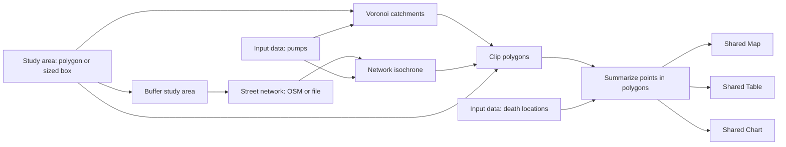

# Experiment 32: John Snow workflows as shared catchment primitives

_Created 2026-10-07 · Updated 2026-10-08_

Date: 2026-10-07. Status: local browser prototype. This implements a bounded translation of the two reviewed methods, not a numerically identical notebook replay. Source reviews: [Voronoi](../research/john-snow-voronoi.md), [isochrones](../research/john-snow-isochrones.md). Practitioner steps: [worked-example guide](../examples/john-snow.md).

## Question and implementation

Can a practitioner distinguish proximity allocation, network reachability and population aggregation by connecting reusable widgets, inspecting parameters, and tracing evidence? Scientific correctness, browser functionality and learning effectiveness are separate evaluation claims.

The diagram shows alternative catchment branches; each supplied workspace connects one branch to its own Clip and Summary. Shared point inputs retain their full editing forms and references. New typed ports distinguish `network`, `polygons`, `points` and `area`. Outputs select polygon mode rather than pretending computational results are semantic decisions. Voronoi, Street network, Network isochrone, Clip polygons, Summarize points in polygons and Buffer study area are independently registered at 0.1.0. Map 0.6.0, Table 0.3.0 and Chart 0.2.0 add polygon mode; Study area 0.2.0 adds sized boxes. Existing modes retain their contracts.

## Computational decisions

**Voronoi.** An independent half-plane intersection algorithm constructs the nearest-site partition in configurable WGS84 UTM coordinates through [Proj4js](https://proj4js.org/). One, two and collinear sites work; coincident sites are rejected pending an explicit merging policy. Sites outside the reporting area may compete. A finite metric envelope surrounds the study bounds; the separate Clip polygons operation applies the exact reporting geometry. Limits: 100 located sites, local reporting diagonal under 50 km, latitude within 80 degrees and coordinates within six degrees of the selected zone's central meridian. This guard is not an accuracy certification. Original notebook angular Voronoi is not silently reproduced.

**Network.** Street network is a specialized input, with one optional Study area connection used for acquisition and a common directed graph result. It accepts directed WGS84 OSMnx GraphML, Fieldwork graph JSON and Overpass JSON files. Uploads preserve their existing extent. Projected GraphML, unsupported geometry and missing endpoints are rejected; no inference of topology from arbitrary line layers. Raw files are represented by normalized inline graph data and a source-file hash; the original uploaded file is not embedded in project export. Attach additional citations using References. The bundled GraphML and derived graph have separate attribution in [NOTICE](../../examples/john-snow/NOTICE.txt).

**OSM download.** An explicit button sends the connected boundary's envelope plus 0–2,000 m margin to the fixed HTTPS Overpass endpoint. The [Overpass QL request](https://wiki.openstreetmap.org/wiki/Overpass_API/Overpass_QL) uses complete highway ways and referenced nodes; it does not sever edges at a polygon. Holes and nonrectangular outside space therefore remain in the acquisition envelope. Request size is capped at 6 km across, response at 2 MB, time at 35 seconds, normalized graph at 2,000 nodes / 5,000 directed edges / 30,000 geometry vertices. Failure, byte overflow, partial-response remarks or a changed workflow leave the previous graph intact. Saved graphs run offline; downloads require service availability and browser CORS access. Graphs retain query, bounds, boundary, margin, retrieval time, OSM base timestamp, SHA-256 and ODbL attribution.

The walking filter is deliberately limited: allowlisted highway types, explicit foot exclusions, private access unless foot is permitted, pedestrian direction, and conservative exclusion of conditional ways and unapproved barrier nodes. Motor-vehicle one-way tags do not imply pedestrian one-way travel. No turn-restriction relations, slope, wheelchair access or stairs penalty are modeled. Uploaded graphs must document their own travel-mode filtering. This is an analytical prototype, not pedestrian navigation guidance.

**Respectful service pacing.** Downloads never happen during workflow execution or automatic reload. One request runs at a time, followed by at least 60 seconds before another attempt, including failures. A visible countdown disables the button; the deadline survives reload in localStorage. Web Locks coordinate same-origin tabs where supported; older browsers retain the session/deadline guard but cannot promise atomic cross-tab exclusion. Longer `Retry-After` instructions on HTTP 429/503/406 extend the pause. There are no queued jobs, automatic retries, background refreshes or parallel tile-style downloads. The browser sends its origin as referrer to identify the requesting site, without the page path or query. The [public instance guidance](https://wiki.openstreetmap.org/wiki/Overpass_API#Public_Overpass_API_instances) is a service constraint, not a throughput target. Existing saved graphs provide reuse without another API request.

**Isochrone.** Directed Dijkstra uses supplied edge length / configured metres per minute, nearest-node snapping with a maximum distance, and a single configurable cumulative time threshold. Inbound reverses graph traversal. Partial edges interpolate along supplied curved geometry by length fraction; supplied cost length may differ from the geometric length. Snapping is reported but its off-network travel is not charged. [Turf buffer](https://turfjs.org/docs/api/buffer), using its JSTS subset and local azimuthal equidistant projection, produces the configured metre corridor around reachable segments, preserving holes with eight quadrant segments. The UTM CRS applies to snapping and partial-edge interpolation, not the buffer projection. This is an approximation of accessible off-street space. No hull infill or exact continuous travel-time surface is claimed. At most ten sites; each browser operation runs in a disposable Worker with a 45-second timeout. Duplicate one-minute/five-minute operations to compare thresholds; do not add their cumulative counts.

**Clip and summary.** [polyclip-ts](https://github.com/luizbarboza/polyclip-ts) intersects GeoJSON polygon collections with the reporting boundary in CRS84 coordinate space, preserving holes and multipart features. Empty intersections are omitted, so a site with no reporting-area intersection has no row; a retained polygon with no observations has a zero count. Summary retains all memberships and explicitly reports outside, missing-location and multiply assigned locations. Boundary inclusion is configurable. Location count and numeric-field sum are distinct; non-numeric/missing values are counted rather than coerced. Numeric overflow fails. Chart supports nonnegative totals; Table retains signed values. These are counts, not rates or causal assignments. Spatial joining and aggregation are currently one transparent operation; independently materialized membership tables and generic aggregation are a future decomposition.

## Reporting boundary versus acquisition boundary

Buffer study area creates a new geometry and identity using a 0–5,000 m Turf/JSTS buffer. The original reporting polygon is unchanged, and old area measurements are not copied to the enlarged geometry. Feed the buffer to Street network or other acquisition nodes; retain the original area for population selection and final clipping. If this buffer supplies the desired margin, set the network's additional envelope margin to zero. The supplied Snow network is a fixed snapshot: connecting a larger buffer does not expand those saved bytes. Choose OSM download explicitly or upload a larger graph.

A buffer reduces boundary-related underestimation but cannot guarantee coverage. Repeat an assessment with a larger acquisition extent and compare results inside a fixed reporting boundary. Any stable result is evidence for that tested configuration, not proof of global completeness. Candidate facility search extent can require independent expansion as well.

Study area accepts a drawn polygon, a free bounding rectangle, explicit west/south/east/north coordinates, or a square/rectangle defined by centre and metre dimensions. Sized boxes use a local spherical conversion at the centre, remain north-aligned CRS84 boxes, and are approximate ground dimensions. They are not square degree spans, rotated projected-grid squares, or survey boundaries. Dimensions are limited to 1–50,000 m and latitude to 80 degrees; geometry is the saved authority and controls are reconstructed from its bounds. Dragging corners afterward makes a free rectangle. Buffers are limited to local source extents spanning at most one degree.

## Semantics and provenance

GeoSPARQL Feature/Geometry/WKT describes catchment and buffer geometry. PROV activities identify sources, computation and presentation. QUDT records buffer metres. Fieldwork activity classes distinguish Voronoi, reachability, overlay, summary and network input. Parameter JSON, methods, CRS, caveats, node snaps and summary diagnostics appear in computation receipts; numeric geometry is computed in TypeScript and then expressed as N3 facts. These operations do not claim that EYE proved numerical geometry correctness. Study-area readiness still uses the existing N3 rule.

Graph nodes and edge endpoint inventory are included in the project manifest. Full normalized graph, parameters and references travel inside workflow JSON or encrypted project packages, with no runtime network fetch needed to replay saved inputs. Manifest checks are completeness checks, not cryptographic authentication of the whole graph. New configurations remain application-validated; dedicated SHACL shapes and executable per-version dispatch are not implemented by these registry entries.

## Developmental evaluation

Ask the practitioner to predict which deaths change catchment when moving a pump, distinguish 250 locations from 489 deaths, explain why a five-minute corridor can leave locations unmatched, and explain why a larger download buffer must not enlarge the reporting population. Compare boundary include/exclude, speed and corridor width separately. Keep predictions, configured parameters, run receipts and explanations together; award no scientific validity merely for a connected canvas.

Regression checks cover degenerate Voronoi sites, known curved partial-edge reachability, directed inbound/outbound differences, holes, boundary policy, overlaps, missing data, explicit OSM query bounds, incomplete/oversized responses, file validation, buffered boundary independence, saved parameters, shared outputs and offline browser replay. Pinned source regression expectations are 250 matched locations / 489 deaths for Voronoi and 216 locations / 433 deaths for the default five-minute corridor. These are implementation baselines, not an independent reproduction of notebook results. Reference-engine comparison and learning-effectiveness studies remain future work.

Validation on 2026-10-07: full gate passed 88 unit tests and 54 Chromium scenarios, including the local Botswana WorldPop raster. After pacing and presentation refinements, nine focused numerical/acquisition/pacing cases and the four new Chromium scenarios passed. A small live browser download succeeded at 11:46 UTC with 83 nodes and 146 directed edges; metadata and response checksum are recorded under ignored `test-results/osm-live.json`. Earlier requests without an origin referrer were rejected; no proxy or browser security bypass was introduced. Endpoint availability is not guaranteed. Firefox/WebKit and independent numerical-engine parity have not been established.
## Follow-up

[Experiment 33](33-isochrone-plot-and-interactive-map.md) extends this initial slice with a bounded threshold list, explicit optional infill, NB04-style plot and interactive map, and canvas-to-library primitive highlighting. The single-time, hole-preserving behavior described above remains the default for older saved configurations. The revised Snow template uses four thresholds and infill explicitly.
