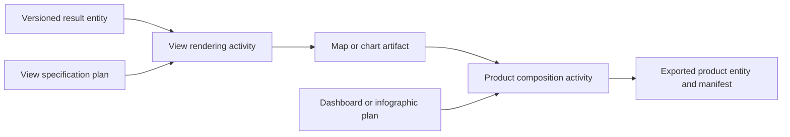

# Communication layer: maps, charts, infographics and dashboards

Date: October 7, 2026. Status: design specification. This document maps communication products to existing Fieldwork terms and candidate extensions; it does not add widgets, ontology declarations, SHACL shapes, renderers or exporters. It joins the [shared visualization design](16-semantic-visualization-design.md) and [publication-product design](17-workflow-publication-products.md).

## Semantic boundary

A communication view presents a result; it must not silently create a scientific result. A configured view is a `prov:Plan`, its rendering is a `prov:Activity`, and a saved artifact is a `prov:Entity`. Existing `fw:MapView`, `fw:ChartView` and `fw:TableView` denote **activities** in run receipts. Do not retype them as plans, files or dashboards. A dashboard is an ordered composition of views and controls; an infographic is an authored, usually fixed composition of indicators, visuals and explanation. Static and interactive maps may share a result but need distinct view specifications, interaction policies and artifacts.

| Element | Existing Fieldwork alignment | Reused vocabulary | Proposed local contract and implementation status |
| --- | --- | --- | --- |
| Detailed static map | `fw:MapView` activity over GeoSPARQL features | [GeoSPARQL 1.1](https://docs.ogc.org/is/22-047r1/22-047r1.html) geometry; [PROV-O](https://www.w3.org/TR/prov-o/) lineage; Dublin Core title | Ordered layers, extent, source/display CRS, symbols, legend, scale, attribution, export dimensions and text alternative. Isochrone SVG exists; a general static exporter does not. |
| Detailed interactive map | `fw:MapView` activity over the same result contract | GeoSPARQL/PROV-O; optional [Web Annotation](https://www.w3.org/TR/annotation-vocab/) for authored callouts | Layer controls, filters, popups, selection scope and offline basemap policy. Bounded Leaflet interaction exists; portable interactive export is proposed. |
| Chart | `fw:ChartView` activity; `fw:CategoricalCount` computation where used | [RDF Data Cube](https://www.w3.org/TR/vocab-data-cube/) for statistical dimensions/measures where applicable; CSVW field types, QUDT units and SKOS categories | Mark, field/channel bindings, axes, scale, units, missing values and table alternative. Categorical bars and a bounded Vega-Lite bar/dot enhancement exist; broader families below are proposed. |
| Infographic | Composition of result entities and views; no current local class | PROV-O, [Dublin Core Terms](https://www.dublincore.org/specifications/dublin-core/dcmi-terms/), optional Web Annotation | Ordered panels, bound values, narrative, units, caveats, citations, reading order and versioned template. No authoring/export widget. |
| Dashboard | Composition of result entities and views; no current local class | PROV-O, Dublin Core; [DCAT 3](https://www.w3.org/TR/vocab-dcat-3/) for described source datasets/distributions | Ordered panels, scoped controls, refresh policy, selected run, timestamp, empty states and printable alternative. No authoring/export widget. |

These standards do not supply a complete dashboard-layout or narrative-binding vocabulary. Fieldwork should define only the missing terms after semantic admission. OGC portrayal concepts can inform map style, but styling does not redefine GeoSPARQL geometry or analytical membership. Do not assert `owl:equivalentClass` from similar labels. [Vega-Lite](https://vega.github.io/vega-lite/docs/) is a candidate chart renderer grammar, not an RDF ontology.

### OGC cartographic concepts as the map-vocabulary template

The [OGC Symbology Conceptual Core Model](https://www.ogc.org/standards/symbology-conceptual-core-model/) supplies a controlled conceptual language for geographic portrayal: style, symbolizer and related extensions. [OGC API - Maps](https://docs.ogc.org/is/20-058/20-058.html) distinguishes map portrayal from the underlying geospatial resource and supports requesting a map with a selected area, time, resolution, CRS and style. Use these as map-profile design references; SymCore is an encoding-neutral conceptual model, not an RDF ontology or a drop-in Leaflet style schema.

| OGC/cartographic concept | Fieldwork vocabulary candidate | Required semantic connection |
| --- | --- | --- |
| Map / portrayal | `MapSpecification` | Exact result snapshot, presentation purpose, geographic/time scope and view or export CRS; keep analytical study area separate from camera extent. |
| Layer | `MapLayerBinding` | Stable feature/raster/result entity, geometry or grid role, explicit z-order, visibility and attribution. |
| Style / symbolizer | `MapStyle`, `MapSymbolizer` | Feature/measure binding, symbol shape, stroke/fill/color/opacity and scale-dependent rule; style is presentation, never intrinsic feature meaning. |
| Thematic classification | `MapClassBreak` | Upstream measure, units, method, break values, inclusion rules and missing/no-data class; computed rates remain upstream results. |
| Legend and map furniture | `MapLegend`, `MapDecoration` | Explain symbol meanings, units, boundary, scale, north indication when appropriate, source attribution and caveats. |
| Interactive state | `MapInteractionScope` | Layer visibility, selected feature, time/filter state and popup field contract; name the snapshot behind a static export. |

These names are candidate Fieldwork terms, not declarations or claimed OGC term IRIs. Review SymCore's specific class/property definitions and version before formal alignment; use a narrow `skos:closeMatch` only when the semantics actually match. The local renderer adapter translates the admitted profile into Leaflet/SVG configuration and preserves that configuration with a versioned receipt. A map's spatial features remain GeoSPARQL entities regardless of how they are styled.

## Chart families and data contracts

| Chart | Required source meaning and checks | Status |
| --- | --- | --- |
| Bar / grouped bar | Stable category keys, numeric measure, order, unknown bin; identify people, events, records or modeled values. | Categorical bars implemented, with a bounded Vega-Lite alternative; grouped bars proposed. |
| Line / area | Ordered temporal/continuous axis, granularity, measure, missing-period policy, denominator for rates; no silent interpolation. | Proposed. |
| Scatter / bubble | Two numeric fields with units; optional size/color bindings, missing-value policy; association is not causation. | Proposed. |
| Histogram | Numeric variable, explicit bin edges and inclusion rule; recorded binning, frequency versus density. | Proposed. |
| Box / interval | Recorded quartiles or estimates and interval method, sample size, units and outlier convention. | Proposed. |
| Choropleth / graduated symbols | Versioned geographic join, measure, scale, denominator where appropriate, no-data styling and legend. This is map portrayal over a computed result. | General profile proposed; bounded catchment and isochrone maps exist. |

The visual mark does not determine the measure. Rates, intervals and aggregates need identifiable upstream computations. RDF Data Cube describes structured statistical observations, not every chart or point table. A label or palette change should rerender without changing the analytical result entity.

### Vega-Lite as the chart-vocabulary template

Use Vega-Lite's documented [mark](https://vega.github.io/vega-lite/docs/mark.html), [encoding channels and measurement types](https://vega.github.io/vega-lite/docs/encoding.html), [transforms](https://vega.github.io/vega-lite/docs/transform.html) and [selection parameters](https://vega.github.io/vega-lite/docs/selection.html) as the design grammar for a *bounded* Fieldwork chart profile. This is a mapping from a JSON visualization grammar to our own RDF terms; Vega-Lite does not publish those JSON keys as an RDF ontology.

| Vega-Lite concept | Fieldwork vocabulary candidate | Required semantic connection |
| --- | --- | --- |
| `data` | `ChartSourceBinding` | Exact source/result entity and run snapshot; local asset digest where packaged. No untracked remote data URL. |
| `mark` | `ChartMarkKind` | Controlled mark value such as bar, line or point; describe visual form, never the measure or scientific method. |
| `encoding` (`x`, `y`, `color`, `size`, `tooltip`) | `ChartChannelBinding` | Stable field IRI/key and role; resolve source schema, CSVW datatype, quantitative/temporal/ordinal/nominal measurement type, QUDT unit and SKOS category where applicable. |
| `scale`, `axis`, `legend` | `ChartScale`, `ChartGuide` | Domain/range, units, ordering, missing/unknown label and color scheme; disclose truncation or nonlinear scales. |
| `transform` and inline aggregate/bin/timeUnit | `ChartDerivedDataBinding` | Allow formatting and declared display filtering locally; material counts, rates, binning or time aggregation require an identifiable computation/result and provenance. |
| `params` / selection | `ChartInteractionScope` | State target panels, chosen values, and whether a selection filters display or requests an explicit new computation. |

These candidate names are not ontology declarations. The first implementation should cover only allowed marks/channels and generate a pinned Vega-Lite JSON artifact from validated Fieldwork bindings. Keep the exact JSON with renderer/schema version for reproducibility, while the RDF records identity, meaning, units and provenance. Do not attempt a one-to-one RDF copy of the whole Vega-Lite schema. The adapter should reject unsupported transforms or field/type combinations with a user-facing explanation.

## Composition identity, evidence and validation

Candidate local terms, pending admission: `CommunicationSpecification` and `ViewSpecification` as `prov:Plan`; `ProductComposition` as `prov:Activity`; `CommunicationArtifact` as `prov:Entity`; plus `PanelBinding` and `InteractionScope`. These are placeholders, not ontology declarations. A panel binding must target an exact result snapshot and view specification. Use RDF lists or indexed membership for panel/layer order; triple order is not layout order. Existing visualization outputs are terminal, so composition first needs an artifact/reference port distinct from data and decision ports.

Each panel needs result/run identity, fields or geometry, units/CRS, time/geographic scope, display filters, renderer/version, accessibility alternative and attribution. A product needs audience, title, author, template/version, ordered panels, result-linked claims, export time and stale/refresh policy. Its manifest records media types, digests and external resources. A citation records support, not scientific correctness. Unknown, zero, excluded and outside-boundary statuses remain distinct across captions, legends and tables. A dashboard filter must not silently change upstream computations or another panel's denominator.

Before adding a composition or new-chart primitive, follow the [ontology audit procedure](../ontology-audit.md): define meaning/exclusions, roles, typed ports, units/CRS, provenance, missing-data policy, reuse, SHACL shapes, and positive/negative fixtures. Proposed shapes check bindings, unique panel IDs, ordering, role separation and filter targets. Application checks resolve actual fields/assets and browser checks inspect marks, legends, popups, reading order and offline behavior. SHACL cannot establish numerical correctness, scientific interpretation or reader comprehension.

First bounded exercise: use one pinned John Snow isochrone run for static SVG and interactive maps plus a catchment-count bar chart, then compose a one-page infographic and two-panel dashboard mockup. Compare exact count-table values and thresholds independently. Test a missing location, changed run, unavailable basemap, mismatched unit and filter scoped to only one panel. The infographic/dashboard remain designs until composition, export/reopen and browser tests exist.
