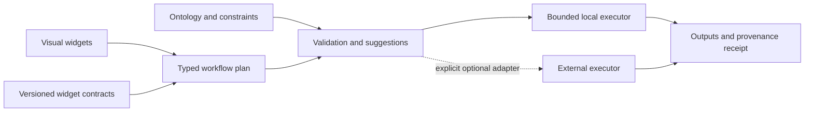

# Prior art: concepts and tools to adapt and adopt

_Created 2026-10-07 · Updated 2026-10-08_

Date: 2026-10-06. Status: design specification and comparative research notes.

## Purpose and design position

Fieldwork explores visual GIS workflows for public-health digital twins: practitioners connect reusable widgets, inspect processing parameters, record evidence, and execute bounded analyses locally in a browser. This document identifies precedents and concrete reuse opportunities. It distinguishes documented upstream capabilities from proposed Fieldwork adaptations. No dependency or external service is selected or installed by this document.

Our working position is to adapt established workflow concepts first, adopt interoperable descriptions where semantics match, and evaluate external execution tools through optional adapters. Keep the current React Flow interface, local execution and N3/GeoSPARQL evidence contract while testing those adapters. The combination is a research hypothesis, not a claim of uniqueness or a patent prior-art search.

## Comparison and disposition

| Prior art | Verified overlap | Concepts to adapt | Tools or artifacts to evaluate for adoption | Present disposition |
|---|---|---|---|---|
| openEO | Visual Earth-observation workflows and a client/backend processing contract | Process discovery, capability declarations, graph exchange | Process specifications; Web Editor as an interaction reference; a future process-graph adapter | Adapt descriptions first; remote execution optional |
| QGIS Processing Modeler | Graphical chains of parameterized GIS algorithms | Explicit inputs/outputs, reusable models, model help and validation | QGIS as an independent desktop comparator for selected operations | Adapt interaction patterns and use for validation; no embedded runtime selected |
| Geo Engine | Raster/vector stream processing with spatial and temporal parameters | Query scope, bounded execution and separation of processing from display | API descriptions and clients for a possible external executor | Adapt resource-planning concepts; defer server integration |
| Automated Pipeline Explorer (APE) | Ontology-informed workflow synthesis | Semantic port compatibility, constrained suggestions and tool annotations | APE CLI/API as a research comparator; ontology/tool-annotation export | Adapt semantic descriptions; test synthesis separately from execution |

The entries below supply the sources and limitations behind this comparison. None establishes browser-local WASM equivalence with Fieldwork.

## 1. openEO: process descriptions and portable graphs

**Evidence.** openEO provides a browser editor for visual algorithm construction. Its API separates clients from processing backends and exposes capabilities, data discovery and process discovery. Available processes vary by provider. Sources: [user introduction](https://openeo.org/documentation/1.0/index.html), [architecture](https://openeo.org/documentation/1.0/developers/arch.html), and [process catalog](https://openeo.org/documentation/1.0/processes.html).

**Fieldwork adaptation.** Enrich each widget release with a machine-readable operation description: typed inputs/outputs, parameter constraints, default values, units, missing-data policy and execution requirements. Keep the operation's meaning separate from the implementation that runs it. A local executor could advertise only the operations and CRS combinations it actually supports.

**Adoption candidate.** Prototype a one-way export of a small supported workflow subset to an openEO process graph. Produce a mapping report for every node. Refuse unsupported or semantically different operations, rather than approximating them silently. A name such as “clip” is insufficient to establish equivalence: pixel selection, masking, CRS, resolution and NoData behavior must match.

The [openEO Web Editor repository](https://github.com/Open-EO/openeo-web-editor) is an Apache-2.0 project with its own UI and backend configuration. Inspect it for discovery and parameter-editing patterns; replacing Fieldwork's React Flow canvas is not the initial experiment. A remotely executed graph would be an explicitly selected online path. It would not satisfy local/offline execution merely because its editor runs in a browser.

## 2. QGIS: mature processing interactions and comparison fixtures

**Evidence.** QGIS Model Designer composes algorithms into reusable models with declared inputs. It supports model validation, selected-step execution, help for parameters and outputs, saving models, and Python export. See the [Model Designer manual](https://docs.qgis.org/4.2/en/docs/user_manual/processing/modeler.html) and [Processing introduction](https://docs.qgis.org/4.2/en/docs/user_manual/processing/intro.html).

**Fieldwork adaptation.** Make processing parameters visible on the operation; identify intermediate versus final outputs; add concise help explaining what each parameter changes. Future reusable subworkflows should expose a small public parameter set and retain the internal graph. Saved iteration history and run history should remain distinct.

**Adoption candidate.** Use QGIS as an independent comparison environment for clipping, area calculations and later zonal statistics. Record the QGIS version, processing provider, exact algorithm and parameters, CRS and fixture hashes. Compare grid alignment, inclusion decisions, valid/missing values and numerical tolerances. A matching screenshot alone is not sufficient evidence.

QGIS is a desktop comparison tool in this design. We have not demonstrated importing arbitrary `.model3` files or running its processing environment inside a browser. Review licenses for the exact components before copying code; borrowing interaction concepts does not require copying its implementation.

## 3. Geo Engine: resource-aware geospatial execution

**Evidence.** Geo Engine documents stream-based raster/vector workflows, spatial/temporal parameters and a server API consumed by its UI. Its repository contains a Rust server/core, generated API clients and an Angular frontend, and declares Apache-2.0 licensing. Sources: [platform overview](https://www.geoengine.io/) and [source repository](https://github.com/geo-engine/geoengine).

**Fieldwork adaptation.** Describe requested spatial extent, time range and resolution before computing. Estimate decoded cells and bytes, then choose a bounded execution plan. Carry source and operation identifiers through that plan so that window acquisition, analytical clipping and display filtering remain distinguishable in provenance.

This is especially relevant to the Botswana raster: request or decode a bounded native window, apply an explicit clip, then render the result. Streaming or windowed decoding alone does not guarantee fewer network bytes. Actual download reduction depends on source layout and server range/subset support; record measured transfer separately from retained asset size.

**Adoption candidate.** Evaluate an API adapter only if a future workflow exceeds browser limits and the practitioner explicitly chooses external execution. Persist the submitted parameters, service/version identity, returned asset hashes and execution location in the receipt. Do not silently upload local data on a memory-budget failure. The reviewed server architecture is not evidence of an existing drop-in WASM build.

## 4. APE: semantic workflow composition

**Evidence.** APE takes a domain ontology, tool annotations, desired inputs/outputs and constraints to synthesize candidate workflows. It exposes a CLI and API, requires Java 17 or later, supports workflow exports and is Apache-2.0 licensed. Its repository also identifies GIS use cases. See [APE source and documentation](https://github.com/Workflomics/ape). The listed [geovisualization case-study paper](https://doi.org/10.1007/978-3-030-24302-9_53) is a follow-up reading item; its full text has not been evaluated here.

**Fieldwork adaptation.** Distinguish a syntactically connectable port from a scientifically compatible input. A raster is not sufficiently described by the word “raster”: CRS, coverage, bands, units, resolution and interpretation can constrain an operation. A proposed connection should explain which conditions hold, which fail and which remain unknown.

**Adoption candidate.** Export a small widget subset as APE tool annotations and compare its candidate workflows with Fieldwork's N3 routing approach. Run this as a separate research exercise; Java execution is not part of the offline browser runtime. Translate results back into reviewable proposed graphs rather than executing them automatically.

APE's synthesis and Fieldwork's N3 evidence reasoning serve different roles. Finding a compatible chain does not establish that its data are reliable, its assumptions justified, or its public-health interpretation valid. Practitioner review and run evidence remain necessary.

## Shared architecture and ontology mapping

The following is a proposed integration boundary, not an implemented universal intermediate representation:

| Fieldwork concept | Reuse direction | Semantic requirement |
|---|---|---|
| Widget release | openEO descriptions and APE annotations | Stable identity and version; explicit parameter/port contracts |
| Workflow definition | QGIS models and openEO graphs | Preserve the authored plan, separate from a particular run; align with PROV Plan |
| Study area and cutline | Spatial parameters across the compared tools | GeoSPARQL feature/geometry identity and explicit CRS; preserve their different roles |
| Input asset | Geo Engine scope and APE data types | Format, extent, resolution, units, missing-data policy and source provenance |
| Compatibility result | APE constraints and local N3 routing | Explain supported, incompatible and unknown conditions; absence of a fact is not proof of compatibility |
| Run and output | Reproducible processing | PROV activity/entity links, actual parameters, engine/version, asset hashes and attached evidence |
| Learning evidence | Fieldwork-specific extension | Record explanation and transfer performance separately from valid connections or successful execution |

Use SHACL for declared data/configuration constraints, N3 for explicit inference and explanations, and computational adapters for numerical operations. Passing SHACL does not establish numerical accuracy or validate a scientific assumption. Do not equate external process identifiers with Fieldwork ontology classes without an explicit mapping and tests.

The [widget registry](../widgets/README.md), [STAC/processing and SHACL design](experiments/15-stac-processing-shacl.md), [N3 evaluation approach](experiments/11-n3-output-evaluation.md), and [learning design](experiments/27-workflow-learning-and-gamification.md) are the local integration points. Registry version pins and general migrations remain future work; cataloging a release does not yet select an executor at runtime.

## Candidate experiments and acceptance evidence

| Priority | Bounded experiment | Evidence required before adoption |
|---|---|---|
| 1 | Document Raster input → Clip raster → Map as explicit operation contracts | Every parameter, unit, coverage requirement and missing-data behavior can be traced to validation and run evidence |
| 2 | Repeat the Old Naledi clip in QGIS | Pinned fixture and algorithm; explain any cell, grid or NoData differences; no unsupported equivalence claim |
| 3 | Export a compatible subset to openEO | Explicit mapping report; unsupported nodes rejected; parameters and expected result semantics preserved |
| 4 | Compare APE suggestions with N3 routing on a small catalog | Known valid, invalid and unknown cases; record coverage and explanation quality, not just number of suggested workflows |
| 5 | Explore Geo Engine external execution | Demonstrated need, explicit data-transfer choice, result/provenance round trip and preserved local behavior |

For usability, ask practitioners to construct the same small workflow, explain its parameters, diagnose an incompatible input, and transfer the idea to another dataset. Record assistance needed, errors and explanations. Keep runtime correctness, interoperability and learner effectiveness as separate outcomes.

## Adoption and ecosystem review

### John Snow isochrone case study

The [pinned notebook review](research/john-snow-isochrones.md) examines the supplied PHI case study's NB03/NB04 network reachability, polygon construction, spatial counting and map/chart outputs. It maps those steps to Fieldwork primitives and records method differences, execution uncertainties and file-specific licensing questions before code reuse. This is a worked public-health workflow precedent, not evidence that the Python geospatial stack already runs offline in Fieldwork.

The companion [Voronoi catchment review](research/john-snow-voronoi.md) examines Advanced Part 2: hull/buffer construction, Voronoi generation, clipping, point counts and building overlays. It identifies explicit projection, generator identity, boundary/tie handling and aggregation as reusable contracts, and distinguishes modeled catchments from observed service use.

Before selecting a concrete dependency, record its exact repository, release/commit, license/NOTICE and transitive dependencies, supported platforms, bundle/runtime cost, offline behavior, release history and issue responsiveness. Check whether more than one person or institution maintains the required component. Do not use stars or the existence of documentation as a substitute for a maintenance assessment.

The reviewed openEO editor, Geo Engine repository and APE repository declare Apache-2.0; that does not by itself settle the licensing of every dependency, dataset or hosted service. No dependency license audit or maintainer-support assessment has been completed in this comparison. Use local fixture data for integration experiments; remote providers' data terms remain separate from software reuse.

All upstream references were checked on 2026-10-06. Update this document when a candidate is tested, adopted or rejected, recording the evidence and linking its implementation decision. Retain rejected alternatives when they explain an architectural choice.
