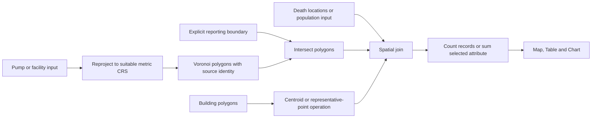

# John Snow case study: Voronoi catchment workflow reuse

Reviewed 2026-10-07. Source inspection only; no notebooks executed or upstream implementations copied into Fieldwork.

Repository: [PHI-Case-Studies/1854-Cholera-Outbreak-London-Advanced-2](https://github.com/PHI-Case-Studies/1854-Cholera-Outbreak-London-Advanced-2). Inspected master at commit `d1b56c135b0fab2f470b837a51e6777dfc20b286`. Notebook cell numbers below are zero-based JSON indices.

## Observed workflow

- [NB02: Computing Convex Hulls](https://github.com/PHI-Case-Studies/1854-Cholera-Outbreak-London-Advanced-2/blob/d1b56c135b0fab2f470b837a51e6777dfc20b286/NB02-Computing-Convex-Hulls.ipynb) constructs a hull from pump and death locations, buffers it by `0.002` coordinate units and stores it as EPSG:4326 geometry (cells 14–43). This is a data-derived extent, not an independently supplied study boundary or a metre buffer.
- [NB03: Constructing Voronoi Polygons](https://github.com/PHI-Case-Studies/1854-Cholera-Outbreak-London-Advanced-2/blob/d1b56c135b0fab2f470b837a51e6777dfc20b286/NB03-Constructing-Voronoi-Polygons.ipynb) uses SciPy Voronoi and a finite-region reconstruction helper (26–30), associates cells with pump attributes (36–43), intersects them with the saved hull (48–50), and counts death locations in each polygon (61–70). It exports shapefile/GeoJSON results and plots counts.
- [NB04: Interactive Voronoi Map](https://github.com/PHI-Case-Studies/1854-Cholera-Outbreak-London-Advanced-2/blob/d1b56c135b0fab2f470b837a51e6777dfc20b286/NB04-Interactive-Voronoi-Map-Folium.ipynb) joins pump identities with catchment counts and produces Folium layers and charts. Polygon colors represent location counts; death markers separately use the `DEATHS` attribute.
- [NB05: Buildings in Voronoi Cells](https://github.com/PHI-Case-Studies/1854-Cholera-Outbreak-London-Advanced-2/blob/d1b56c135b0fab2f470b837a51e6777dfc20b286/NB05-Buildings-in-Voronoi-Cells.ipynb) requests OSM building features around Soho, transforms them to EPSG:3395, compares polygon intersections/differences with centroid selection, counts centroids per catchment and joins building counts with death-location counts. These are distinct overlay methods, not interchangeable definitions of buildings belonging to a catchment.

## Fieldwork primitive mapping

Hull and Buffer are optional upstream operations for a data-derived boundary; they should not be hidden inside Voronoi. General polygon intersection, reprojection, Voronoi and building-polygon inputs are candidate primitives, not implemented capabilities implied by this diagram. The current generic GeoPackage input remains restricted to supported point layers.

## Adaptation decisions

**Make the metric explicit.** NB03 attaches EPSG:4326 to the generated polygons and does not project the pump coordinates before the SciPy call. This produces a Euclidean partition of angular coordinate space. A Fieldwork distance interpretation should use a suitable projected metric CRS, or a separately specified geodesic method. Changing the metric may change assignments: retain the original calculation as a labeled legacy comparison, not a supposedly identical result. NB05's later reprojection does not retroactively change how NB03 constructed its cells.

**Separate analysis extent from observed outcomes.** A hull built partly from death locations changes when those observations change. Expose that dependency in the workflow and receipt. For comparative facility-access analyses, prefer a fixed reporting boundary and a documented candidate search extent. Include outside-boundary facilities when they can compete for locations inside it.

**Retain generator identity and verify coverage.** Each Voronoi cell should carry its originating facility ID directly. Spatially joining pump points back to cells can be ambiguous with duplicate coordinates or boundary ties. Finite-region reconstruction is an implementation device; verify that the reconstructed polygons fully cover the intended reporting extent before clipping. Handle zero, one, two, coincident and collinear sites deliberately rather than passing every case blindly to a general tessellation routine.

**Expose containment and aggregation policy.** The [point-count helper](https://github.com/PHI-Case-Studies/1854-Cholera-Outbreak-London-Advanced-2/blob/d1b56c135b0fab2f470b837a51e6777dfc20b286/resources/points_in_polygons.py) uses strict `contains`, excludes boundary points and removes assigned records from a working copy. If polygons overlap, assignment therefore depends on processing order. Fieldwork should return explicit memberships and unresolved ties; preserve unassigned records and use stable IDs rather than relying on a DataFrame index. Count records and sum `DEATHS` are separate aggregation choices. Neither count is a population-adjusted mortality rate.

**Keep building summaries interpretable.** A geometric centroid can lie outside a concave building; a representative interior point answers a different assignment question. Polygon intersection can split one building among cells, while point assignment allocates a whole building. Record the selected rule. OSM buildings in NB05 are not established as 1854 building stock, households or population denominators. A metric CRS alone also does not guarantee area-preserving density estimates; choose and record an appropriate area method if calculating density.

**Treat catchments as modeled allocation.** Pump/facility proximity partitions do not establish actual water-source use, facility attendance, service availability or causal attribution. Reuse the common evidence/eligibility profile and record assumptions separately from geometry computations.

## Reuse and validation boundary

The root [LICENSE](https://github.com/PHI-Case-Studies/1854-Cholera-Outbreak-London-Advanced-2/blob/d1b56c135b0fab2f470b837a51e6777dfc20b286/LICENSE) contains Apache 2.0. The [finite Voronoi helper](https://github.com/PHI-Case-Studies/1854-Cholera-Outbreak-London-Advanced-2/blob/d1b56c135b0fab2f470b837a51e6777dfc20b286/resources/voronoi2.py) credits an external gist, and the README notes inherited licenses. Verify helper-specific provenance and data terms before copying code; conceptual adaptation is the current action.

The [environment file](https://github.com/PHI-Case-Studies/1854-Cholera-Outbreak-London-Advanced-2/blob/d1b56c135b0fab2f470b837a51e6777dfc20b286/environment.yml) lists SciPy, GeoPandas, Shapely, OSMnx 1.x and pandas 1.x among its dependencies. This is a Python/Binder notebook precedent, not demonstrated browser/WASM execution. No runtime engine is selected here.

Validate a future primitive first on synthetic sites with known bisectors and assignments, then against a pinned notebook replay. Test complete clipped coverage, non-overlapping interiors, stable site IDs, missing/boundary records, degenerate sites and count conservation. Compare angular legacy versus projected results explicitly. Compare centroid assignment and polygon intersection using a building that straddles a cell boundary. Keep location counts, weighted death totals and population-normalized measures distinct.

Together with the [isochrone notebook review](john-snow-isochrones.md), this supplies two worked branches over common point inputs: proximity allocation and travel-time reachability. Use the [facility-access primitives design](../experiments/31-facility-access-primitives.md) to compare them with independent receipts, method-specific result tabs and a shared reporting extent.

Implementation follow-up: [Experiment 32](../experiments/32-john-snow-primitives.md) adds bounded shared catchment primitives and two runnable workspaces. Its methods and runtime evidence are separate from this source-inspection/design record.
